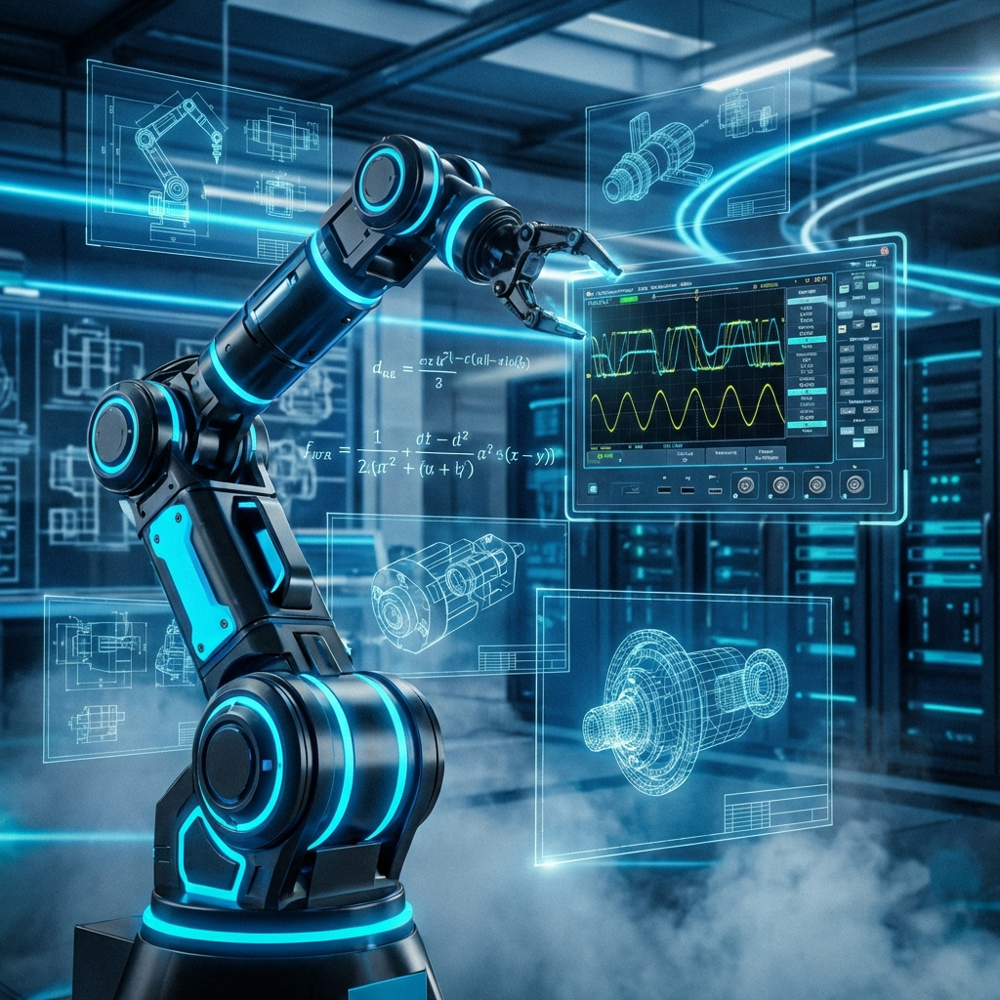

  <a href="../README.md">🏠 Home</a> | 
  <b>[ 📚 Fundamentals ]</b> | 
  <a href="../02_Electrical_Electronics/README.md">⚡ Electronics</a> | 
  <a href="../03_Mechanics_Materials/README.md">⚙️ Mechanics</a> | 
  <a href="../04_Programming_Embedded/README.md">💾 Embedded</a> | 
  <a href="../05_Control_Robotics/README.md">🦾 Robotics</a> | 
  <a href="../06_Projects_Labs/README.md">🧪 Laboratory</a>

---

# 01. Mühendislik Temelleri: MYO Öğrencisi İçin Arıza Teşhisi

> *"Matematik bizim için bir ders değil, makinenin hayati verilerini okumak için kullandığımız bir osiloskop probudur. Biz, 'can çekişen' bir sistemin çığlığını duymak için bu dili öğreniyoruz. Teorik bir formül, sahada ya bir robotun sarsılmaz dengesidir ya da feci bir mekanik çöküşün habercisidir."*

---

## 🛡️ Metal Yaka Perspektifi: MYO'da Başarı Sahada Çözümdür

Mühendislik temelleri, MYO (Önlisans) öğrencileri için sınav kağıdında bırakılacak formüller değildir. Bir tekniker için bu dersler, sahada karşılaştığı "Neden çalışmıyor?" sorusunun anahtarıdır. Biz bu dersleri; **akademik sınavları geçmek için değil, sanayi sahasında hayatta kalmak için** öğreniyoruz.

*   Diferansiyel denklemi sadece teorik olarak çözemezseniz; sahada deli gibi titreyen, kararsızlığa düşmüş bir PID kontrolcüsünü asla sakinleştiremezsiniz.
*   Statik ve Mukavemet bilmezseniz; tasarladığınız robot kolunun neden yük altında esnediğini, neden beklenen hassasiyette (tekrarlanabilirlik) çalışmadığını asla anlayamazsınız.
*   Termodinamik bilmezseniz; dünyanın en iyi kodunu da yazsanız, o işlemcinin neden sürekli "Thermal Throttling" yaparak sistemi yavaşlattığını çözemezsiniz.

Bu modülde, akademik ispatların steril ve soğuk dünyasından çıkıp; gürültülü, yağlı ve gerçek olan **teşhis (diagnosis)**, **kestirimci bakım (predictive maintenance)** ve **öngörü (prediction)** dünyasına adım atıyoruz.

---

## 🧠 1. Kalkülüs: Değişimin ve Geleceğin Lisanı

Sanayide "duran" bir makine ya kapalıdır ya da bozuktur. Çalışan, değer üreten her makine sürekli bir **değişim** halindedir. Isınır, hızlanır, yavaşlar, basınçlanır, titreşir ve aşınır. Kalkülüs, işte bu değişimi anlama ve yönetme sanatıdır.

### Türev (Derivative): Hatanın Ayak Sesleri
Bizim için türev, grafikteki bir teğetin eğimi değildir. Türev, **geleceğin bilgisidir**.
*   **Hata Hızı (Rate of Error):** Sensör verisindeki anlık değişim hızı, bize hatanın ne kadar hızlı büyüdüğünü söyler.
*   **Öngörü:** PID kontrolcüsündeki 'D' (Derivative) terimi, türev sayesinde geleceği tahmin eder. "Hata şu an küçük ama çok hızlı artıyor, hemen fren yapmalıyım!" diyerek sistemi kaza yapmaktan kurtarır.
*   **Saha Karşılığı:** Motorun sıcaklığı 1 saatte 5 derece arttıysa sorun yok (D düşük). Ama 1 dakikada 5 derece arttıysa (D çok yüksek), fan bozulmuş veya bir kısa devre oluşmuş demektir. Termal koruma devreye girmelidir.

### İntegral (Integral): Geçmişin Yükü ve Hafıza
İntegral, birikimdir. Geçmişte yaşananların bugüne etkisidir.
*   **Birikmiş Hata (Accumulated Error):** PID'deki 'I' (Integral) terimi, geçmişteki küçük ama giderilememiş hataları toplar ve "Yeter artık, hedefe ulaşmak için daha fazla güç uygulamalıyız" der.
*   **Saha Karşılığı:** Hidrolik tankındaki mikro sızıntıyı anlık basınç sensörü fark etmez (Türev sıfıra yakın). Ama sızıntıyı zamana göre integre ederseniz (toplarsanız), tankın yarısının boşaldığını görürsün. İntegral, sinsi hataları yakalar.

---

## ⚛️ 2. Fizik: Mühendisliğin Değişmez Anayasası

Yazılım dünyasında kuralları programcı koyar; gerekirse o kuralları değiştirebilir, esnetebilir ("hack") veya baştan yazabilir. Ancak fiziksel dünyada kurallar evrenindir (Newton, Termodinamik, Maxwell) ve bu kurallar asla tartışılamaz, rüşvet verilemez.

*   **Eylemsizlik (Inertia):** "Duran durmak, giden gitmek ister." 200 kg'lık bir robot kolunu 2 m/s hızla sürerken birden durduramazsınız. Durdurmaya çalışırsanız, o enerji bir yerden çıkar (redüktör dişlisini kırar, kayışı koparır, robotun taban cıvatalarını söker).
*   **Enerjinin Korunumu:** Enerji yok olmaz, sadece şekil değiştirir. Genellikle de istemediğimiz bir şekle: **Isı**. Verimsiz her sistem, faturayı ısı olarak öder.

---

## 🔥 Metal Yaka Saha İpuçları (Field Hacks)

> [!TIP]
> **Titreşim Analizi (Dokunsal Teşhis):** Bir pompanın veya motorun üzerine elinizi koyduğunuzda hissettiğiniz titreşim, aslında düşük frekanslı bir "Fourier Analizi"dir. Eğer titreşim düzensiz ve "vuruntulu" ise (impulse), bu mekanik bir boşluk (backlash) veya rulman dağılmasıdır. Eğer titreşim yüksek frekanslı ve "ince" bir zırıltı ise, bu genellikle elektriksel bir dengesizlik veya gevşek bir kaplinin işaretidir.

> [!CAUTION]
> **Termal Teşhis:** Bir kablonun veya klemensin ısınması, direncin arttığının (Kötü temas, korozyon) fiziksel kanıtıdır. Elektrik akımı geçerken o noktada oluşan voltaj düşümü ısıya dönüşür. Eğer bir klemens kapağı hafifçe sararmışsa, arıza henüz başlamamıştır ama "yoldadır".

---

## ⚠️ Yaygın Hatalar ve Kök Neden Analizi

*   **Hata:** PID kontrolcü sürekli osilasyon (salınım) yapıyor, bir türlü hedefe oturmuyor.
    *   **Kök Neden:** Muhtemelen P (Proportional) kazancı çok yüksek veya sistemde mekanik bir gecikme (dead-time) var ve Differential (D) terimi bu gecikmeyi kompanse edemiyor.
*   **Hata:** Robot kolu repetitif (tekrarlı) hareketlerde her seferinde birkaç milimetre sapıyor.
    *   **Kök Neden:** Rijidite (esneklik) sorunu. Statik hesaplamalarda göz ardı edilen yük momenti, kolun mekanik sınırlarını zorluyor veya bir kaplin kaydırıyor.

---

## 📚 Modül İçeriği ve Saha Rehberi

Bu klasörde, teorik ders kitaplarının aksine, "Bu bilgi ile sahada nasıl arıza çözerim?" sorusuna odaklanan notlar bulacaksınız.

| Dosya | Açıklama | Saha Uygulaması |
| :--- | :--- | :--- |
| **[`01_Calculus_Diagnostics.md`](./01_Calculus_Diagnostics.md)** | Kalkülüs ile Sistem Teşhisi | PID ayarı, Isı artış analizi, Sızıntı tespiti. |
| **[`01_Physics_Safety.md`](./01_Physics_Safety.md)** | Fizik Yasaları ve İş Güvenliği | Eylemsizlik momenti, Tork hesabı, Potansiyel enerji tehlikeleri. |
| **[`02_Linear_Algebra_Robotics.md`](./02_Linear_Algebra_Robotics.md)** | Robotik için Matrisler | İleri/Ters Kinematik, Singularity, Koordinat sistemleri. |

---

> **Ustanın Bilgelik Notu:**  
> "Formülleri ezberlemek için hafızanızı yormayın; onların grafiklerini, fiziksel hissini ve sesini hayal edin. Bir sinüs dalgası gördüğünüzde aklınıza trigonometri sınavları gelmesin; aklınıza saniyede 50 kez yön değiştiren şebeke voltajı (AC) veya harmonik hareket yapan, titreyen bir yay sistemi gelsin. Matematik kağıt üzerinde değil, makinenin metal gövdesinde yaşar."
