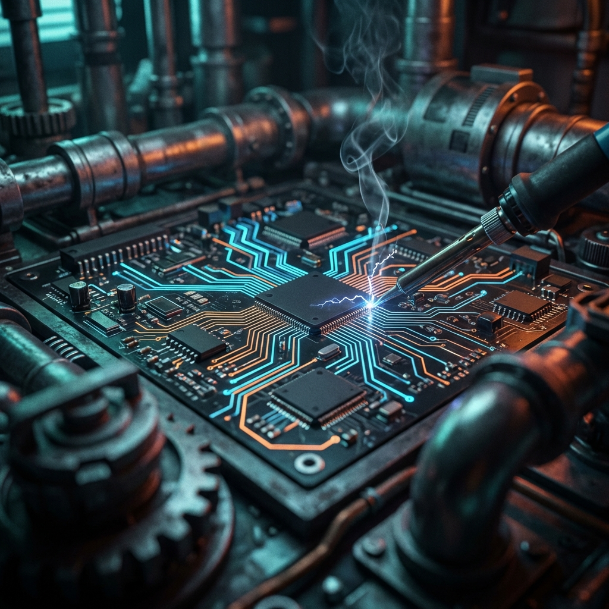

  <a href="../README.md">🏠 Home</a> | 
  <a href="../01_Engineering_Fundamentals/README.md">📚 Fundamentals</a> | 
  <b>[ ⚡ Electronics ]</b> | 
  <a href="../03_Mechanics_Materials/README.md">⚙️ Mechanics</a> | 
  <a href="../04_Programming_Embedded/README.md">💾 Embedded</a> | 
  <a href="../05_Control_Robotics/README.md">🦾 Robotics</a> | 
  <a href="../06_Projects_Labs/README.md">🧪 Laboratory</a>

---

# 02. Elektrik & Elektronik: Devre Cerrahlığı ve Dumanın Ruhu

> *"Yazılımda hata yaparsan ekranda bir uyarı çıkar; elektronikte hata yaparsan bir patlama sesi duyarsın ve o korkunç yanık silikon kokusunu alırsın. Ve unutma, duman bir kez çıktıysa, o komponentin ruhu bedeni terk etmiştir; geri döndürülemez. Bizler, o sessiz dumanın yasını tutan değil, o kaosu engelleyen siber-fiziksel koruyucularız."*

---

## ⚡ Metal Yaka Perspektifi: Devre Cerrahlığı

Mezun olduğunuzda kimse sizden Kirchhoff kanunlarını kağıt üzerinde ispatlamanızı istemeyecek. Sizden beklenen; durmuş bir üretim hattındaki panoyu açıp, yüzlerce kablo ve onlarca kart arasından arızalı olan o **tek bir komponenti** bulmanız ve sistemi hayata döndürmenizdir.

Yazılım "Sanal Beyin" ise, Elektronik "Sinir Sistemi" ve "Kardiyovasküler Sistem"dir.
*   **Voltaj:** Kan Basıncıdır.
*   **Akım:** Kan Akışıdır.
*   **Kablo Kesiti:** Damar genişliğidir.
*   **Kısa Devre:** Aort damarının parçalanmasıdır.

Bu modül, sadece teorik şemaları değil, **"Çalışmayan"** veya **"Yanmış"** bir devreyi teşhis etme (diagnosis) ve onarma sanatını; yani **Devre Cerrahliğini** anlatır. Bir tamirci, devredeki akışın ritmini hisseder.

---

## 🛠️ 1. Duman Prensibi ve Geri Dönülmezlik

Elektronik dünyasında "Ctrl+Z" (Geri Al) tuşu yoktur.
*   Bir MOSFET'i yanlış tetikleyip yaktıysan, o artık kömürdür.
*   Bir kondansatörü ters bağlayıp patlattıysan, o artık bir şarapneldir.
*   **Kural:** "Önce Ölç, Sonra Enerji Ver."

### Görünmez Düşman: Gürültü (Noise) ve EMI
Dijital dünyada mantık temizdir (0 veya 1). Fiziksel dünyada ise kaos vardır.
*   **Senaryo:** Motor çalışınca sensör saçmalıyor. Motor durunca düzeliyor.
*   **Teşhis:** Motor kablosu, bir yayın anteni gibi etrafa elektromanyetik parazit (EMI) yayıyor. Sensör kablosu da bir anten gibi bu paraziti topluyor.
*   **Çözüm:** Ekranlı (Shielded) kablo kullanmak, ekranı **tek noktadan** topraklamak, Ferrit boncuk takmak. Yazılımla bunu çözemezsin.

---

## 🧰 2. Teşhis Aletleri: Cerrahın Çantası

### A. Multimetre: Stetoskop
*   **Diiyot Modu:** Yarı iletkenler (Transistör, Regülatör) sağlam mı? PN jonksiyonu 0.6V-0.7V gösteriyor mu? Eğer her iki yönde de 0V veya "Open Loop" (OL) görüyorsanız, cerrahi müdahale şarttır.

### B. Osiloskop: Zamanın Mikroskobu ve Röntgen
Multimetre size yalan söyler. Multimetre size voltajın "ortalamasını" gösterir.
*   3.3V sandığınız DC gerilim, belki de saniyede 1 milyon kez 0V ile 5V arasında dalgalanıyordur (Ripple).
*   **Osiloskopsuz elektronikçi, karanlıkta el yordamıyla yürüyen bir kör gibidir.**

---

## 🔥 Metal Yaka Saha İpuçları (Field Hacks)

> [!TIP]
> **Parmak Testi (Güvenli Alanlarda):** Bir regülatörün veya işlemcinin üzerine parmağınızı yaklaştırdığınızda (dokunmadan hemen önce) yayılan "Isı Baskısı", osiloskoptan daha hızlı teşhis koymanızı sağlayabilir. Eğer parmağınız 1 saniyeden fazla dayanamıyorsa, o komponent "termal kaçak" (thermal runaway) aşamasındadır. Ya yük fazladır ya da çıkışta sinsi bir kısa devre vardır.

> [!IMPORTANT]
> **Kablo Sıyırma Sanatı:** Bir kabloyu sıyırırken içindeki bakır tellere asla zarar vermeyin. Sıyırdığınız her bir kılcal damar, o kablonun akım taşıma kapasitesini ve mekanik dayanıklılığını (yorgunluk ömrünü) %10-%20 oranında azaltır. Titreşimli bir ortamda o zedelenen nokta, sistemin en zayıf halkasıdır.

---

## ⚠️ Yaygın Hatalar ve Kök Neden Analizi

*   **Hata:** Devre kartına enerji verildiğinde sigorta veya sigorta direnci anında yanıyor.
    *   **Kök Neden:** Köprü diyot arızası veya ana anahtarlama transistöründe (MOSFET/IGBT) drain-source arası direkt kısa devre.
*   **Hata:** PLC girişi (Input) "High" görünüyor ama sensör tetiklenmemiş.
    *   **Kök Neden:** "GND (Toprak) Kayması". Sensör hattındaki bir direnç artışı veya zayıf şase bağlantısı nedeniyle sensör low seviyesini tam 0V'a çekemiyor, voltaj "Threshold" değerinin üzerinde kalıyor.

---

## 📚 Modül İçeriği ve Saha Rehberi

| Dosya | Açıklama | Saha Uygulaması |
| :--- | :--- | :--- |
| **[`02_Oscilloscope_Guide.md`](./02_Oscilloscope_Guide.md)** | Osiloskop Rehberi | Sinyal yakalama, PWM analizi, Gürültü tespiti. |
| **[`02_Soldering_Art.md`](./02_Soldering_Art.md)** | Lehim Sanatı | Soğuk lehim tespiti, Flux kullanımı, SMD lehimleme. |
| **[`03_Component_Failure.md`](./03_Component_Failure.md)** | Komponent Arıza Kataloğu | Bir parça neden ve nasıl yanar? Görsel otopsi. |
| **[`04_Grounding_Noise.md`](./04_Grounding_Noise.md)** | Topraklama ve Gürültü | Şase döngüleri (Ground Loops), ekranlama, parazit. |

---

> **Ustanın Bilgelik Notu:**  
> "İyi bir elektronikçi, devrenin şemasına değil, kokusuna ve sıcaklığına güvenir. Yanık bir direnç, sebep değil sonuçtur. O direnci yakan asıl suçluyu (genellikle kısa devre olmuş bir kondansatör veya transistör) bulmadan sakın yenisini takma. Aksi takdirde sadece yedek parçanı israf etmiş olursun."
