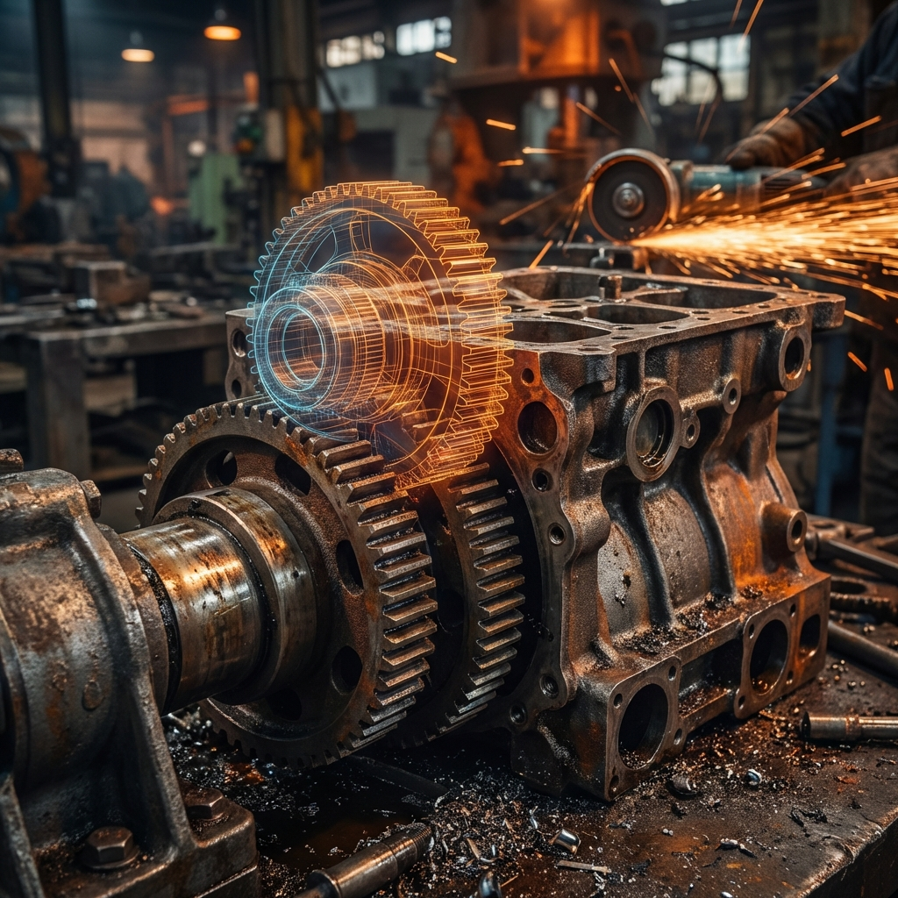

  <a href="../README.md">🏠 Home</a> | 
  <a href="../01_Engineering_Fundamentals/README.md">📚 Fundamentals</a> | 
  <a href="../02_Electrical_Electronics/README.md">⚡ Electronics</a> | 
  <b>[ ⚙️ Mechanics ]</b> | 
  <a href="../04_Programming_Embedded/README.md">💾 Embedded</a> | 
  <a href="../05_Control_Robotics/README.md">🦾 Robotics</a> | 
  <a href="../06_Projects_Labs/README.md">🧪 Laboratory</a>

---

# 03. Mekanik & Malzeme: Metalin Ruhu ve Konstrüksiyon Sanatı

> *"Yazılım esnektir, güncellenebilir ve sanaldır; hatası kolayca düzeltilir. Demir ise serttir, ağırdır ve affetmez. Yazılımı güncellersin, ama kırılan bir mili 'update' edemezsin, ancak değiştirebilirsin. Bizler, metalin direncini de, yorgunluğunu da kendi kaderimiz gibi hissedenleriz."*

---

## 🏗️ Metal Yaka Perspektifi: Mekanik Empati

Mekatronik sistemin "bedeni", iskeleti ve kasları burasıdır. Dünyanın en gelişmiş yapay zekasına (AI) ve en temiz koduna sahip bir otonom araç bile olsa, tekerlek mili kırılırsa veya diferansiyel dişlisi sıyırırsa olduğu yerde kalır.

Bir **"Siber Tamirci"** ve **"Teknoloji Mimarı"** olarak, metalin dilinden anlamak, malzeme bilimine hakim olmak zorundasınız. Makinenin neresinin yağlanacağını, neresinin ne kadar sıkılacağını (Tork anahtarı!), neresinin "metal yorgunluğu" çekmeye başladığını ve dişlilerin arasındaki o mikro boşluğu (backlash) parmak uçlarınızda hissetmelisiniz. Biz buna **"Mekanik Empati"** diyoruz. Makine konuşamaz, ama titreşimiyle ve sesiyle size acı çektiğini anlatır.

---

## ⚔️ 1. Simülasyonun Mükemmelliği vs Gerçekliğin Kusurları

Bilgisayar ekranında (SolidWorks, Fusion 360, ANSYS) çizdiğiniz her parça mükemmeldir. Yüzeyler sonsuz pürüzsüzdür, sürtünme katsayısı sabittir, montaj hatası yoktur, cıvatalar asla gevşemez.
**Gerçek dünyada ise toz vardır, pas vardır, kir vardır, boşluk (backlash) vardır ve en önemlisi titreşim vardır.**

*   **Tolerans ve Geçmeler:** CAD programında 10.00mm çapında bir deliğe, 10.00mm çapında bir mili sokabilirsiniz. Gerçek hayatta o mil o deliğe **GİRMEZ**.
    *   **Sıkı Geçme (Interference Fit):** Mili sıvı azotla dondurup, deliği pürmüzle ısıtıp çakmak gerekir.
    *   **Boşluklu Geçme (Clearance Fit):** Mil rahat dönsün diye delik 10.02mm, mil 9.98mm yapılır. (H7/g6 toleransı).
    *   **Saha Hatası:** "Çekiçle montaj, mühendislik hatasıdır." Rulmanı çekiçle çakarsan, bilyaları zedelersin ve ömrünü o an bitirirsin.

---

## 🧱 2. Malzeme Bilgisi: Neyi Nereden Yapmalı?

### Yorulma (Fatigue): Sessiz Katil
Bir metal parça genellikle "tek seferde" yükü kaldıramadığı için kırılmaz. Milyonlarca kez titreşir, esner, geri gelir. Yüzeyde mikroskobik çatlaklar oluşur ve sonra aniden, beklenmedik bir anda "çıt" diye kopar.
*   **Kestirimci Bakım:** Titreşim analizi (Vibration Analysis) ile bu çatlağın sesini, daha parça kırılmadan duymaktır.

---

## 🔥 Metal Yaka Saha İpuçları (Field Hacks)

> [!TIP]
> **Dişli Sesini Okuma:** Eğer redüktörden "uğultu" (whining) geliyorsa dişliler çok sıkıdır; eğer "şakırtı" (clattering) geliyorsa boşluk (backlash) çok fazladır. İdeal ses, bir fabrikanın uğultusu içinde bile ayırt edilebilen, "yağlı ve ritmik bir vızıltı" olmalıdır.

> [!IMPORTANT]
> **Isıl Genleşme Hesabı:** Uzun bir konveyör hattı veya hassas bir CNC mili üzerine çalışıyorsanız, sıcaklığın metali milimetrik olarak uzattığını unutmayın. Bir milin yatağında sıkışmasının nedeni genellikle dış ortam sıcaklığının artmasıyla milin genleşip yan yataklara baskı yapmasıdır. Her zaman "yüzebilir" (floating) bir yatak noktası bırakın.

---

## ⚠️ Yaygın Hatalar ve Kök Neden Analizi

*   **Hata:** Pnömatik piston bir noktada takılıyor veya düzensiz hareket (stuttering) yapıyor.
    *   **Kök Neden:** "Stick-slip" fenomeni. Keçelerin yağsız kalması veya piston mili üzerindeki mikron düzeyindeki bir yamulma, sürtünme katsayısını bozuyor.
*   **Hata:** Cıvata sürekli gevşiyor, Loctite sürülmesine rağmen tutmuyor.
    *   **Kök Neden:** Rezonans. Sistemin doğal frekansı (Natural Frequency), motorun çalışma devriyle çakışıyor. Cıvatayı sıkmak yerine rezonans frekansını değiştirmeli veya titreşim sönümleyici (isolator) kullanmalısınız.

---

## 📚 Modül İçeriği ve Saha Rehberi

| Dosya | Açıklama | Saha Uygulaması |
| :--- | :--- | :--- |
| **[`03_Material_Fatigue.md`](./03_Material_Fatigue.md)** | Metal Yorgunluğu ve Kırılma | Kırık yüzey analizi (Fraktografi), Yorulma önleme. |
| **[`03_Backlash_Vibration.md`](./03_Backlash_Vibration.md)** | Boşluk ve Titreşim | Redüktör boşluğu ayarı, Rezonans tespiti. |
| **[`03_Production_Methods.md`](./03_Production_Methods.md)** | Üretim Yöntemleri (CNC/3D) | Hangi parça nasıl üretilir? 3D baskı nerede kullanılır? |
| **[`03_Hydraulics_Pneumatics.md`](./03_Hydraulics_Pneumatics.md)** | Hidrolik & Pnömatik | Kavitasyon tespiti, Sızıntı yönetimi ve Valf mantığı. |

---

> **Ustanın Bilgelik Notu:**  
> "Makineyi her zaman dinle. Sağlıklı bir makine, ritmik ve tutarlı bir ses (humming) çıkarır. Düzensiz tıkırtı, sürtünme sesi, tiz bir ciyaklama veya vuruntu... Bunlar makinenin yardım çığlıklarıdır. Eğer bu sesi kırılma gerçekleşmeden önce duyarsan sistemi tamir edersin; duymazsan veya görmezden gelirsen, o makineyi ancak hurdaya atarsın. Metal yorulur, ama usta asla yorulmaz."
