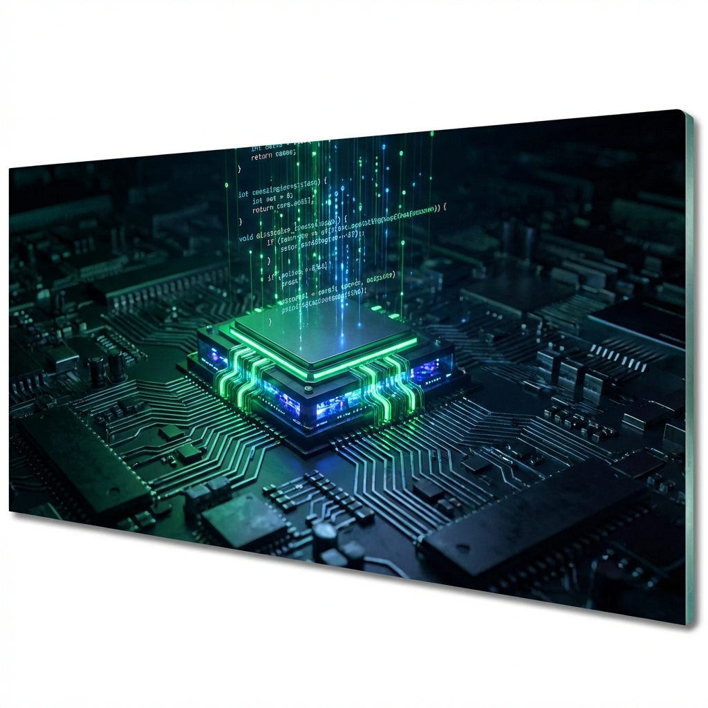

  <a href="../README.md">🏠 Home</a> | 
  <a href="../01_Engineering_Fundamentals/README.md">📚 Fundamentals</a> | 
  <a href="../02_Electrical_Electronics/README.md">⚡ Electronics</a> | 
  <a href="../03_Mechanics_Materials/README.md">⚙️ Mechanics</a> | 
  <b>[ 💾 Embedded ]</b> | 
  <a href="../05_Control_Robotics/README.md">🦾 Robotics</a> | 
  <a href="../06_Projects_Labs/README.md">🧪 Laboratory</a>

---

# 04. Yazılım & Gömülü Sistemler: Silikon Beyin Cerrahlığı

> *"Kod, silikonun ruhudur. Ancak kötü yazılmış bir kod, silikonu ısıtır, yorar, kafasını karıştırır ve sonunda sistemi öldürür. Bizler kod yazıcı değil, silikon cerrahlarıyız. Yapay zekanın yazdığı kodu metale enjekte eden ve o donanıma 'can' veren modern simyacılarınızız."*

---

## 💾 Metal Yaka Perspektifi: Kod Enjeksiyonu ve Optimizasyon

Yapay Zeka (AI) çağında, "Sıfırdan I2C Sürücüsü Yazmak" artık insan için bir övünç kaynağı değildir; bunu bir LLM modeli saniyeler içinde hatasız yapabilir. Yeni çağın meziyeti; o kodu alıp STM32'nin 128KB'lık kısıtlı hafızasına sığdırmak (Optimization), sonsuz döngüye girip sistemi kilitlemesini engellemek (Watchdog), donanımın fiziksel limitlerine (Timing) uydurmak ve milisaniyelik gecikmelere bile tahammülü olmayan makineyle "kekelemeden" konuşturmaktır.

Biz artık "Coder" (Kodlayıcı) değiliz; biz **"Gömülü Sistem Entegratörü"** ve **"Donanım Fısıldayıcısı"**yız.

---

## 🤖 1. İstemi Mühendisliği (Prompt Engineering)

C++ sözdizimini (syntax) ezberlemek hamallıktır. Önemli olan "ne istediğini" teknik bir dille ifade edebilmektir.
*   **Metal Yaka Yaklaşımı:** "STM32G4 serisi için, HAL kütüphanesi ve DMA kullanarak, Timer 1'in 4 kanalını PWM modunda süren, %0-%100 duty cycle arasında 'Soft-Start' (Rampa) özelliği olan ve TIM_Update kesmesi ile motor akımını ADC üzerinden okuyan, Non-Blocking (Bloke etmeyen) bir C fonksiyonu oluştur."

---

## ⏱️ 2. Gerçek Zamanlı (Real-Time) Kısıtlar

Bir web sitesi 1 saniye geç açılırsa kullanıcı sadece oflar. 100km/s hızla giden otonom bir aracın fren sistemi 10 milisaniye geç tepki verirse, kaza olur.
*   **Determinizm:** "Hızlı olmak" değil, "Her seferinde tam zamanında olmak" demektir.
*   **RTOS (Gerçek Zamanlı İşletim Sistemi):** İşlemcinin zamanını mikrosaniyeler mertebesinde dilimleyen trafik polisidir. Mavi ekran verme lüksü yoktur.

---

## 🔥 Metal Yaka Saha İpuçları (Field Hacks)

> [!TIP]
> **Watchdog (Bekçi Köpeği) Kullanımı:** Sistemin takılma ihtimaline karşı her zaman donanımsal Watchdog Timer (WDT) kullanın. Eğer kodun en kritik döngüsü beklenen sürede tamamlanmazsa, Watchdog işlemciye "elektroşok" vererek (Reset) sistemi yeniden başlatır. Unutmayın: "Kilitlenmiş bir sistem, ölü bir sistemdir; resetlenmiş bir sistem ise hayata dönen bir umuttur."

> [!CAUTION]
> **Floating Point (Kayar Nokta) Tuzağı:** Düşük seviyeli işlemcilerde (Cortex-M0 gibi) `float` işlemler donanımsal FPU (Floating Point Unit) yoksa yazılımla simüle edilir ve işlemciyi aşırı yorar. Ondalıklı sayılarla çalışmak yerine, sayıları 100 veya 1000 ile çarpıp "Fixed Point" (Tam Sayı) mantığıyla işlem yapın. Bu, işlemciye %500-%1000 oranında hız kazandırabilir.

---

## ⚠️ Yaygın Hatalar ve Kök Neden Analizi

*   **Hata:** Sistem rastgele zamanlarda, bazen 1 saat, bazen 1 hafta sonra tamamen kilitleniyor.
    *   **Kök Neden:** "Stack Overflow" veya "Dinamik Bellek Fragmantasyonu". `malloc()` kullanımı sonucunda hafıza parçalanmış veya iç içe giren (recursive) fonksiyonlar yığın (stack) limitini aşmış.
*   **Hata:** Seri haberleşmede (UART) veriler bazen bozuk geliyor (Garbage data).
    *   **Kök Neden:** İki cihaz arasındaki "Baud Rate" farkı veya donanımsal bir "Common Ground" (Ortak Şase) eksikliği. Şase bir değilse, sinyal seviyeleri birbirine göre kayar ve veri bozulur.

---

## 📚 Modül İçeriği ve Saha Rehberi

| Dosya | Açıklama | Saha Uygulaması |
| :--- | :--- | :--- |
| **[`04_Prompt_Engineering_Guide.md`](./04_Prompt_Engineering_Guide.md)** | AI ile Kodlama Sanatı | Doğru teknik terimlerle kod yazdırma şablonları. |
| **[`04_RTOS_Basics.md`](./04_RTOS_Basics.md)** | RTOS ve Çoklu Görev | Task, Mutex, Semaphore ve Deadlock kavramları. |
| **[`04_Embedded_C_Traps.md`](./04_Embedded_C_Traps.md)** | C Dilinin Tuzakları | Pointer hataları, Volatile kullanımı, Bitwise işlemler. |
| **[`04_Python_Automation_Basics.md`](./04_Python_Automation_Basics.md)** | Python ile Otomasyon ve Test | PySerial ile donanım testi, Excel'e veri loglama. |

---

> **Ustanın Bilgelik Notu:**  
> "`delay(1000)` komutunu kodunda kullanmak, bir gömülü sistem mühendisi için sahada işlenen bir günahtır. İşlemciyi 1 tam saniye boyunca (ki bu işlemci için 1 asır gibidir) uyutamazsınız; o sırada dünya dönmeye devam ediyor, acil durdurma butonuna basılıyor, sensörler alarm veriyor. `millis()` kullanın, Timer kullanın, RTOS kullanın ama işlemciyi asla kör ve sağır bırakmayın (Non-blocking code). Kodunuz, makinenin nabzı gibi sürekli ve kesintisiz atmalıdır."
