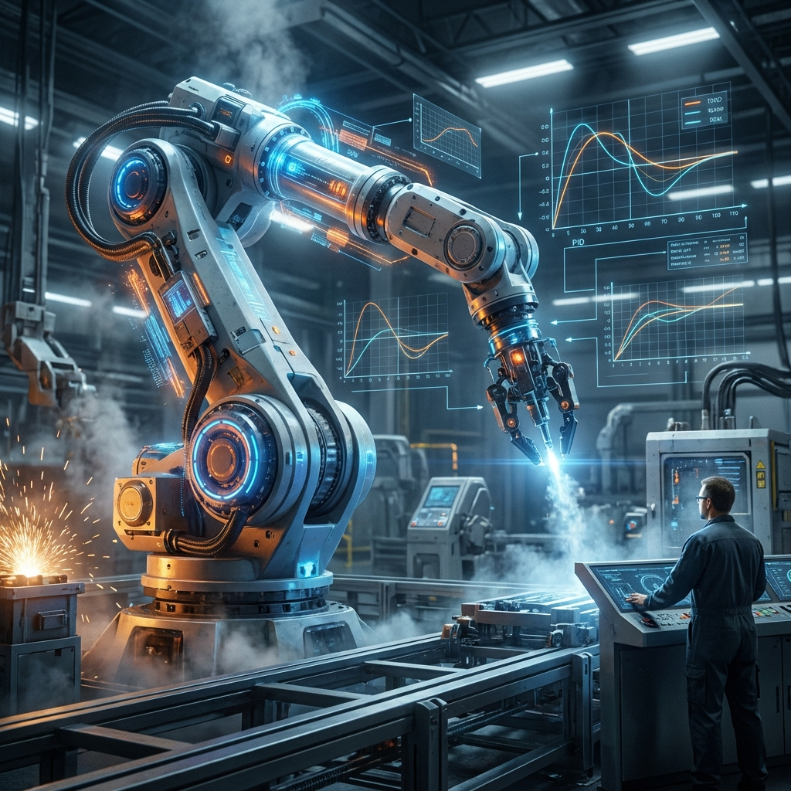

  <a href="../README.md">🏠 Home</a>| 
  <a href="../01_Engineering_Fundamentals/README.md">📚 Fundamentals</a> | 
  <a href="../02_Electrical_Electronics/README.md">⚡ Electronics</a> | 
  <a href="../03_Mechanics_Materials/README.md">⚙️ Mechanics</a> | 
  <a href="../04_Programming_Embedded/README.md">💾 Embedded</a> | 
  <b>[ 🦾 Robotics ]</b> | 
  <a href="../06_Projects_Labs/README.md">🧪 Laboratory</a>

---

# 05. Kontrol Sistemleri & Robotik: Robot Doktorluğu ve Sistem Cerrahlığı

> *"Otonom sistemler (AI) dünyayı yönetecek olabilir; peki o sistemler hastalandığında, delirdiğinde veya travma geçirdiğinde (Kaza) onlara kim bakacak? Bizler, Robot Doktorlarıyız. Bizim stetoskopumuz osiloskop, neşterimiz ise tork anahtarıdır."*

---

## ⚕️ Metal Yaka Perspektifi: Robot Yoğun Bakım Ünitesi (Robot ER)

Otonom bir fabrikadaki robot kolu aniden durduğunda, sorun her zaman "buglı kod" değildir. Belki bir dişli sıyırmıştır, belki triger kayışı gevşemiştir, belki de enkoderin optik okuyucusu tozlanmıştır. Bir AI yazılımında hata (bug) olduğunda sunucuyu yeniden başlatabilirsiniz; ama bir robot kolu 200kg yükle kontrolsüzce bir yere çarptığında onu "tamir" etmelisiniz. **Bu, dijital değil fiziksel ve cerrahi bir müdahaledir.**

---

## 🦾 1. Diagnosis (Teşhis Koyma Sanatı)

Robotun ekranında beliren hata kodu: **"Eksen 4 - Aşırı Akım Hatası (Overcurrent Error)"**.
*   **Beyaz Yaka (Teorist) Yaklaşımı:** Kodu inceler, PID parametrelerini değiştirir, akım limitlerini yazılımla artırır.
*   **Metal Yaka (Cerrah) Yaklaşımı:** Robotun yanına gider. Eksen 4'ün motoruna elini koyar. "Çok mu ısınmış?" (Ateşine bakar). Freni manuel olarak açıp ekseni eliyle hareket ettirmeye çalışır. "Mekanik sıkışma var mı?".

---

## 🎯 2. PID Tuning: Sistemin Nabzını Ayarlamak

PID (Proportional, Integral, Derivative), bir robotun "karakteridir".
*   **P (Anlık Tepki):** Robotun hedefe ne kadar sert yöneleceğini belirler. Çok yüksekse robot titrer, çok düşükse hantallaşır.
*   **I (Sabır ve Birikim):** Hedefe tam oturamayan (Steady-state error) robotu hedefe doğru hafifçe "iter".
*   **D (Öngörü ve Fren):** Robotun hedefe yaklaşırken "savrulmasını" (Overshoot) engeller. Olası bir kazayı önceden sezen frendir.

---

## 🔥 Metal Yaka Saha İpuçları (Field Hacks)

> [!TIP]
> **Ziegler-Nichols "Usta" Metodu:** Bir robotun titreşimini elle hissetmek, ekrandaki her türlü FFT analizinden hızlı sonuç verebilir. Kazancı yavaşça artırın; robotun metal gövdesinde o "kritik rezonans" titreşimini hissettiğiniz an, sınır hattındasınız demektir. O noktadan sonra kazancı %20-30 oranında geri çekmek, sahada en güvenli ve hızlı "tuning" metodudur.

> [!CAUTION]
> **Enkoder Kirliliği:** Hassas robotik sistemlerde rastgele "pozisyon kaybı" (position shift) yaşıyorsanız, hatayı yazılımda aramadan önce enkoder kablolarının ekranlamasını ve optik diskin temizliğini kontrol edin. Yağ buharı ve toz, bir robotun "gözlerini" (enkoderlerini) kör edebilir.

---

## ⚠️ Yaygın Hatalar ve Kök Neden Analizi

*   **Hata:** Robot kolu hedef noktaya ulaşmak üzereyken aniden "Jerky" (sarsıntılı) hareket yapıyor.
    *   **Kök Neden:** Differential (D) kazancı çok yüksek olabilir veya mekanik bir "backlash" (dişli boşluğu) sensör verisini saniyede binlerce kez sarsıyordur. Yazılım donanımsal boşluğu kompanse etmeye çalışırken rezonansa giriyordur.
*   **Hata:** Servo motor tutma (Hold) konumundayken yüksek frekanslı bir ciyaklama (Whining) sesi çıkarıyor.
    *   **Kök Neden:** "Loop Gain" (Döngü Kazancı) çok yüksek. Motor, pozisyonunu mikron düzeyinde korumaya çalışırken aşırı agresif davranıyor. PID parametrelerini biraz daha "yumuşatmak" gerekebilir.

---

## 📚 Modül İçeriği ve Saha Rehberi

| Dosya | Açıklama | Saha Uygulaması |
| :--- | :--- | :--- |
| **[`05_PID_Tuning_Guide.md`](./05_PID_Tuning_Guide.md)** | PID Ayar Rehberi | Motor kararlılığı, salınım engelleme. |
| **[`05_Sensors_Feedback.md`](./05_Sensors_Feedback.md)** | Sensörler ve Geri Besleme | Enkoder hataları, limit switch tamiri. |
| **[`05_PLC_Ladder_Logic.md`](./05_PLC_Ladder_Logic.md)** | PLC Başlangıç Rehberi | Endüstriyel otomasyon mantığı. |

---

> **Ustanın Bilgelik Notu:**  
> "Robotun gücüne asla güvenme, onunla asla şakalaşma. Bir robotun freni açıldığında yerçekimi onun tek yöneticisidir. Her zaman acil durdurma (E-Stop) butonuna yakın dur. Bir usta, robotun sesinden onun huzurlu mu yoksa kavgacı mı olduğunu anlar. Huzursuz makine, kaza getirir."
