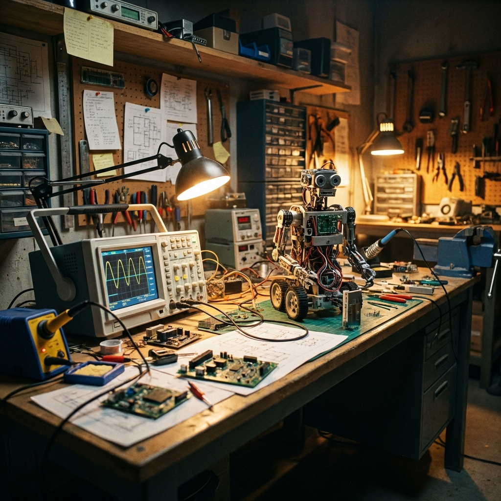

  <a href="../README.md">🏠 Home</a> | 
  <a href="../01_Engineering_Fundamentals/README.md">📚 Fundamentals</a> | 
  <a href="../02_Electrical_Electronics/README.md">⚡ Electronics</a> | 
  <a href="../03_Mechanics_Materials/README.md">⚙️ Mechanics</a> | 
  <a href="../04_Programming_Embedded/README.md">💾 Embedded</a> | 
  <a href="../05_Control_Robotics/README.md">🦾 Robotics</a> | 
  <b>[ 🧪 Laboratory ]</b>

---

# 06. Projeler & Laboratuvar: İspat Meydanı ve Hurdalık

> *"Teoride, teori ile pratik aynıdır. Pratikte ise, dağlar kadar farklıdır. Burası, bilgisayar ekranındaki o 'mükemmel' dünyanın, metalin sert gerçekliğine çarptığı sınırdır."*

---

## 🛠️ Metal Yaka Kültürü: Hata Yap, Kaydet, Öğren

Burası steril bir sınıf veya sessiz bir kütüphane değil; burası bir **hurdalıktır**. Burası, bilgisayar ekranında mükemmel çalışan algoritmaların donanımla buluşunca patladığı, simülasyonda kusursuz oturan tasarımların montajda deliklerinin birbirini karşılamadığı, kabloların koptuğu, dumanların çıktığı ve gerçek öğrenmenin başladığı yerdir.

Bir "Metal Yaka" teknisyeninin CV'si (Özgeçmişi), "başarıyla tamamlanmış temiz projeler" listesi değil; **"karşılaşılan felaketler, patlayan parçalar ve bunlara bulunan dahiyane sahra çözümleri"** kataloğudur.

---

## 🥋 Proje Ağacı ve Seviye Sistemi

### 🟡 Seviye 1: Çırak (The Apprentice)
*Hedef: Bileşenleri tanıma, lehim yapma, basit kontrol döngüsü.*
*   **P1.1 - Analog Hat İzleyen (Çizgisiz):** İşlemci yok. Sadece OpAmp, transistörler ve sensörler.
*   **P1.2 - Akıllı Sera (Histerezis):** Motorun "zırt-pırt" açılıp kapanmasını (Chattering) engellemek için yazılımsal histerezis uygulamak.

---

## 🔥 Metal Yaka Saha İpuçları (Field Hacks)

> [!TIP]
> **Prototipte "Spider Web" Kablolama:** Prototip aşamasında kabloların karmaşık olması (örümcek ağı) kabul edilebilir; ancak her bir hattı mutlaka etiketleyin. Eğer bir kablo koparsa, o karmaşanın içinde doğru ucu bulmak bir "Siber Dedektiflik" gerektirir. Kalıcı projede ise "Industrial Aesthetic" kurallarına (Kablo kanalları, makaronlar) mutlaka uyun.

> [!IMPORTANT]
> **Debug via LEDs:** Elektronik bir sistemde bir şeylerin yanlış gittiğini anlamanın en hızlı yolu, kodun içine "Status LED"leri eklemektir. Bir LED'in yanıp sönme frekansı, işlemcinin o anki "kalp atış hızı"dır. Eğer LED donmuşsa, silikon beyin cerrahisi başlıyor demektir.

---

## ⚠️ Yaygın Proje Hataları ve Otopsi

*   **Hata:** Simülasyonda her şey mükemmel ama gerçek robot her seferinde farklı yerlere gidiyor.
    *   **Kök Neden:** "Mekanik Geri Tepme" (Backlash) veya sensör gürültüsü. Simülasyonlar genellikle sürtünmeyi ve metalin esnemesini (Elastic Deformation) basitleştirir. Gerçek hayatta yerçekimi ve toz asla basitleştirilemez.
*   **Hata:** Kod yüklendikten 5 dakika sonra mikrodenetleyici aşırı ısınıyor ve sistem kilitleniyor.
    *   **Kök Neden:** Bir I/O pininden çekilen akım limitlerin üzerinde. Muhtemelen bir transistör sürmek yerine direkt bir motoru veya yüksek güçlü bir röleyi pinden sürmeye çalışıyorsunuz. Pini yavaşça "pişiriyorsunuz".

---

## 📚 Modül İçeriği ve Şablonlar

| Dosya | Açıklama | Kullanım Amacı |
| :--- | :--- | :--- |
| **[`06_Failure_Log_Template.md`](./06_Failure_Log_Template.md)** | Arıza Kayıt Şablonu | Her patlayan parça, her bug buraya yazılacak. |
| **[`06_Project_L1_LineFollower.md`](./06_Project_L1_LineFollower.md)** | Seviye 1: Hat İzleyen | PID'yi görerek öğrenmek. |
| **[`06_Project_L2_CNC_Build.md`](./06_Project_L2_CNC_Build.md)** | Seviye 2: CNC Yapımı | Mekanik hassasiyet ve eksen kontrolü. |
| **[`06_Project_L3_VisionArm.md`](./06_Project_L3_VisionArm.md)** | Seviye 3: Robot Kol & AI | Kinematik ve OpenCV entegrasyonu. |

---

> **Ustanın Bilgelik Notu:**  
> "Çalışmayan projenizi asla çöpe atmayın. O bir başarısızlık değil, henüz çözülmemiş bir bulmacadır. Dünyanın en iyi mühendisleri, en çok parça bozanlardır; çünkü her bozdukları parçada o malzemenin limitlerini, o kodun açığını ve fiziğin kurallarını yaşayarak öğrenmişlerdir. Boza boza yapmayı öğreneceksiniz. **Hata, bilginin metaldeki izidir.**"
