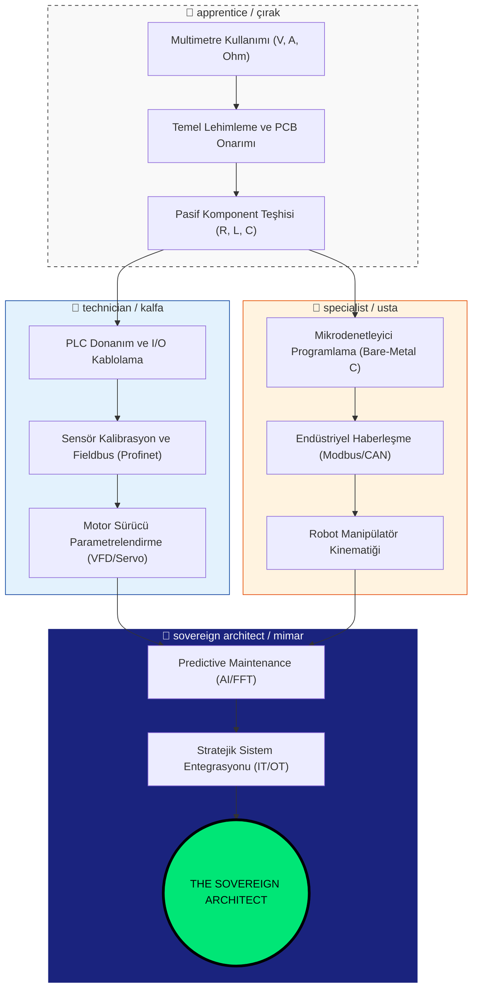
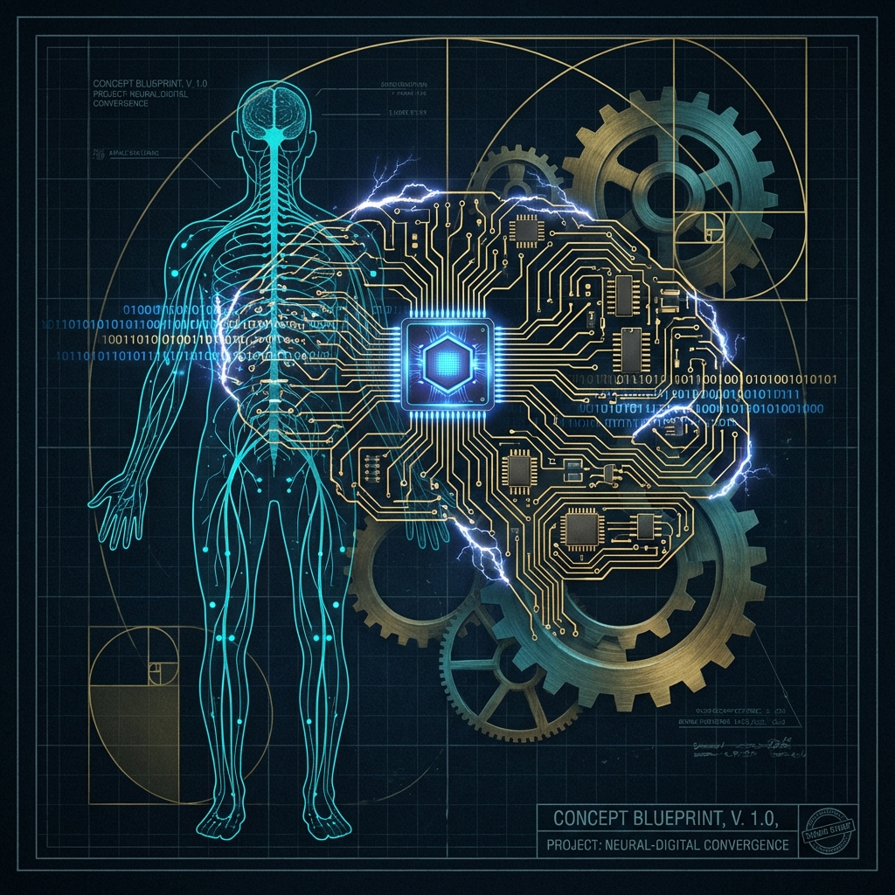
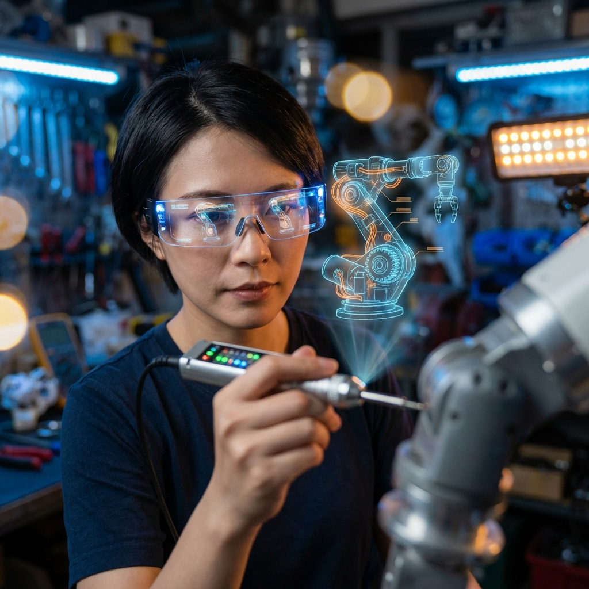
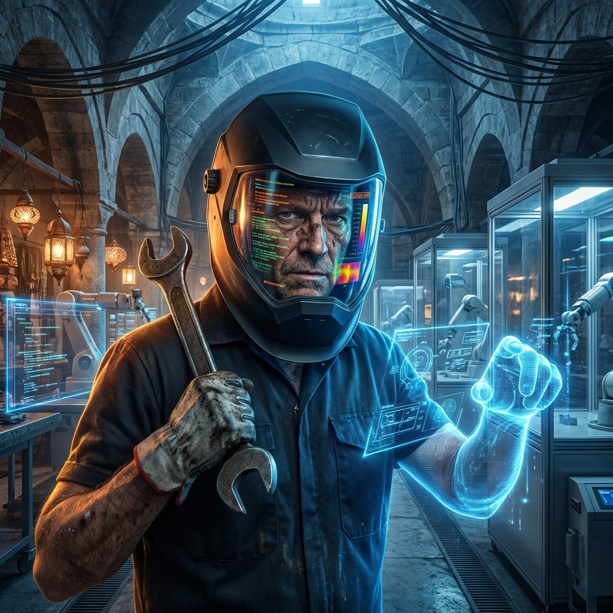
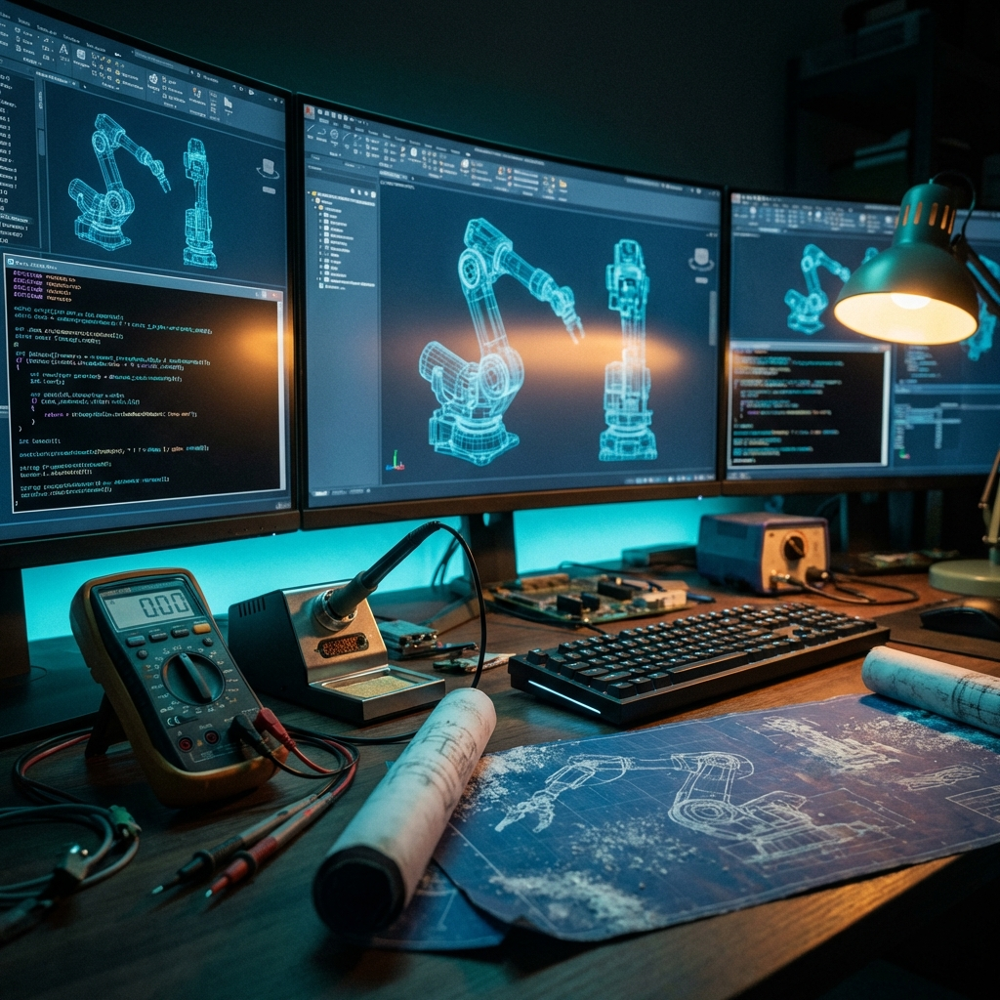

# 🤖 Mekatronik Önlisans & Teknikerlik Müfredatı: Siber Tamircilik ve Endüstriyel Mimari Rehberi

> **Mekatronik MYO (Meslek Yüksekokulu) Öğrencileri, Geleceğin "Saha Mimarları" ve Sarsılmaz "Usta Tamircileri" İçin Hazırlanmış Nihai Yol Haritası**  
> *Bu eser, sadece bir not yığını değil, elleriyle fiziksel dünyaya değer üreten, arızayı daha oluşmadan sesinden ve titreşiminden tanıyan, Türkiye'nin dört bir yanındaki MYO sınıflarında, tozlu atölyelerinde ve gürültülü fabrikalarında dirsek çürüten tüm "Metal Yaka" adaylarına en derin saygıyla ithaf edilmiştir. Sizler, dijitalin kağıt üzerinde kaldığı noktada, gerçeği inşa edenlersiniz.*

## 🏆 Hierarchy of Mastery: Çıraklıktan Siber Mimarlığa Uzanan Yolculuk

Mekatronik, yalnızca bir hobi ya da basit bir iş alanı değil; mekanik, elektronik ve yazılımın kesişim kümesinde icra edilen, disiplinler arası bir modern çağ savaş sanatıdır. Bir sistemin kalbine inmek, onun dilini çözmek ve ona hükmetmek sabır, teknik sarsılmazlık ve vizyon gerektirir. Burada "Tamir", bir şeyi eski haline getirmekten fazlasıdır; o, sistemin ruhunu ve tasarım niyetini yeniden tesis etme eylemidir.

### 🗺️ The Metal Yaka Master Skill Tree
Aşağıdaki harita, bir teknikerin sadece ne bildiğini değil, o bilgiyi fiziksel dünyada nasıl bir "kudrete" dönüştürdüğünü gösteren evrimsel gelişim yoludur:

---

## 🎒 Field Readiness: Profesyonel Saha Çantası ve Zihinsel Hazırlık

Gerçek bir Metal Yaka, sahaya (field) hazırlıksız çıkmaz. Yanındaki aletler, onun siber-fiziksel dünyadaki uzuvlarıdır.

> [!IMPORTANT]
> **Minimalist ama Sarsılmaz Ekipman Listesi:**
> 1.  **Duyuların Ötesinde Bir Multimetre:** Sadece voltaj ölçen değil, RMS değeri veren, kapasitans ve frekans ölçebilen endüstriyel tip bir ölçü aleti (CAT III/IV standartlarında).
> 2.  **Siber-Fiziksel Arayüz (Laptop):** Üzerinde tüm haberleşme yazılımları (TIA Portal, Codesys, Arduino IDE, Python/C++ toolchains) kurulu, tam şarjlı ve Ethernet portu olan (veya kaliteli bir dönüştürücü) ana kumanda merkeziniz.
> 3.  **Haberleşme Kabloları (The Nervous System):** USB-TTL dönüştürücüler, Profinet kabloları, RS-485 (Modbus) arayüzleri. Sahada "kablo yok" demek, "ellerim yok" demektir.
> 4.  **Cerrahi Müdahale Seti:** Hassas tornavidalar, kaliteli bir yan keski, izolasyon sıyırıcı ve ferul (yüksük) sıkma pensesi.

Temel amacımız, sadece okuldaki vize ve final sınavlarını geçmek, kuru bir diploma sahibi olmak değildir. Gerçek hedefimiz, **Yapay Zeka (AI)** ve otonom sistemler devriminin ardından temellerinden sarsılan, her gün yeniden tanımlanan global endüstriyel ekosistemde ayakta kalacak, vazgeçilmez bir mesleki kimlik ve "Master Technician" markası inşa etmektir. Unutmayın ki, Türk sanayisinin (ve dünyanın) şu an her zamankinden daha fazla ihtiyacı olan şey, teorik formüllerle boğulan değil, **"sahada o karmaşık işi bizzat çözen"** ve sistemi ayağa kaldıran nitelikli, vizyoner ve korkusuz insan gücüdür.

Bu dijital kütüphane, akademik dünyanın o muazzam fakat bazen statik kalan **teorik derinliği** ile; Türkiye'nin dört bir yanındaki Organize Sanayi Bölgelerinin (OSB), devasa iş makinelerinin sağır edici gürültüsü ve yanık metal kokusuyla harmanlanmış **pratik endüstriyel gerçekliğini** birleştiren eşsiz, sarsılmaz bir köprüdür. 20. yüzyılın "her şeyi kağıt üzerinde sıfırdan hesapla ve aylarca tasarla" diyen hantal mühendislik yaklaşımı artık yerini daha çevik bir sürece bırakmıştır: "Yapay zekanın saniyeler içinde tasarladığı, hayal gücünü zorlayan o karmaşık sistemleri fiziksel dünyada birbirine bağla, onları yaşat, farklı protokolleri birbiriyle konuştur (entegrasyon) ve en zor şartlar altında dahi hatasız çalıştır." İşte bu depo, diferansiyel denklemlerin o steril dünyasından çıkıp, o denklemlerin kumanda ettiği devasa bir robot kolunun içindeki sinsi bir hidrolik sızıntıyı tespit edip onarmaya giden o terli, yağlı ama onurlu yolun detaylı, santim santim işlenmiş haritasıdır.

### 🛡️ Manifesto: MYO Kültürü ve "Yeni Nesil Tamircilik" Devrimi

> *"Bizler sadece sınav kağıtlarını testlerle dolduran, koridorlarda amaçsızca gezen öğrenciler değiliz; bizler modern endüstrinin acil servisi, teknolojik cerrahlarıyız. Bir mühendis sistemi en ideal şartlar için tasarlar, bir AI mimarisini kusursuzca kurar, biz ise o sistemi MYO laboratuvarlarının kısıtlı imkanlarından çıkarıp fabrikaların acımasız gerçekliğinde, tozun, nemin ve gerilimin ortasında hayata döndürürüz. Bizim imzamız, dönen çarklardadır."*

Mekatronik Önlisans eğitimi, bir teorik bilgi yığını veya sadece zaman geçirme yeri değil, sarsılmaz bir **hayatta kalma, kriz yönetimi ve pratik çözüm üretme** okuludur. Bu depo, klasik beyaz yaka mühendislik yaklaşımlarının sahadaki beklenmedik bir "noise" (gürültü) veya mekanik sıkışma karşısında çaresiz kaldığı o kritik "X" anında, bir teknikerin nasıl parladığını ve sistemin kaderini değiştirdiğini anlatır. Temel misyonumuz, sadece bir mezuniyet belgesi almak değil, karşılaştığınız her türlü teknolojik enkaza bakıp **"Bu arıza benden sorulur, bu makine mutlaka dönecek"** diyebilen sarsılmaz bir özgüven ve mesleki vakar inşa etmektir. Bizler, hatanın içinde saklı olan düzeni görenleriz.

#### 🌌 Dijital İkizlerden Gerçek Yağ Lekelerine: Köprü Olmak
Modern endüstri, "Digital Twin" (Dijital İkiz) kavramıyla simülasyonların büyülü dünyasına sırtını yaslıyor. Her şey ekranlarda kusursuz, her hareket simule edilmiş durumda. Ancak, hiçbir simülasyon yazılımı, bir hidrolik hortumun en kritik üretim anında patladığı o saniyedeki kaosu, bir MOSFET'in aşırı yüklenip havayı o meşhur ozon kokusuyla doldurduğu anı veya bir optik sensörün üzerine binen mikronluk toz tabakasının yarattığı veri gürültüsünü tam olarak öngöremez. İşte bizler, o pırıltılı simülasyonların sınırlarına ulaştığı ve gerçek dünyanın fiziksel, yıpratıcı ve kaotik kurallarının başladığı "O Sınır Hattı"nda devreye gireriz.

**Metal Yaka İnisiyatifi**'nin asıl kalbi, MYO sınıflarında, akşam mesailerinde ve teknik lise atölyelerinde atar. Bizler, iki farklı evren (Soyut Tasarım ve Somut Arıza) arasındaki en hayati, en kopmaz halkayız. Yapay zeka bir robotu en optimum açılarla tasarlayabilir; fakat o robotun "mekanik tesisatını" kimseyle konuşmadan döşeyecek, "damarlarındaki" veri akışını manuel olarak kontrol edecek ve sistem sustuğunda, tüm veri yolları kapandığında ona o sihirli "ilk nefesi" üfleyip uyandıracak olan bizleriz. Bu, **Tekniker 2.0**'ın doğuşudur: Bir elinde profesyonel multimetre, zihninde yapay zekanın sınırsız kütüphanesi olan, "sahayı" bilen ama "teoriyi" de yöneten siber zanaatkarların, yani sizin geleceğinizdir.

### 🎯 Vizyon & Misyon: Yeni Nesil Tamircilik ve Onarım Kültürü

*   **Vizyonumuz: Geleceği Onaran Ellerin Mimarisi**  
    Yapay zeka destekli en ileri dijital tasarım tekniklerini, Anadolu'nun bin yıllık sarsılmaz "Usta-Çırak" geleneği ve "Ahi Evran"ın dürüstlük, liyakat ve yüksek zanaatkarlık kültürüyle harmanlamak. Bizim vizyonumuz; sadece tüketen değil, duran devasa fabrikaları, yazılımsal olarak kilitlenen karmaşık otonom sistemleri ve mekanik yorgunluğa yenik düşen robotları, teknik bilgelik ve modern araçlarla yeniden hayata döndüren, küresel sektörün en çok aranan "Sovereign Technician" (Egemen Tekniker) neslini yetiştirmektir. Bizler, dijital kaosun fiziksel düzenleyicileriyiz.

*   **Misyonumuz: Bilişsel Kaldıraç ve Pratik Bilgelik**  
    Bir teknikerin omuzlarındaki gereksiz, tekrarlayan ve yorucu teorik hesaplama yüklerini modern AI asistanlarına (ChatGPT, Claude, Gemini vb.) stratejik bir zekayla devretmesini sağlamak. Bu sayede insan zihninin odak noktasını; asıl katma değerli alan olan "Hassas Arıza Tespiti (Advanced Diagnosis)", "Sistemler Arası Karmaşık Entegrasyon" ve "Sistemi Her Şartta Ayakta Tutma" sanatına kaydırmak. Amacımız; pratik, tecrübe odaklı ve "kirli el" prensibine dayalı endüstriyel bilgiyi herkes için erişilebilir, sarsılmaz bir "Field Manual" (Saha Kılavuzu) formatına dönüştürerek, teknikeri operasyonel bir araçtan, sistemin vazgeçilmez bir stratejistine dönüştürmektir.

---

## 🏗️ Depo Yapısı ve "Tamircinin Bakış Açısı"

Bu depo, bir teknikerin zihnindeki "Arıza Çözme Algoritması"na göre yapılandırılmıştır. Her modül, sahada karşılaşılan bir sorunun çözüm basamağını temsil eder.

| Dizin | Odak Noktası | Tekniker Ne Yapar? |
|-----------|-------------|----------------------------------------------------|
| [`01_Engineering_Fundamentals`](./01_Engineering_Fundamentals/) | Teşhis | Makinenin dilini (fiziğini) anlar, anomalileri tespit eder. |
| [`02_Electrical_Electronics`](./02_Electrical_Electronics/) | Müdahale | Devreye cerrah titizliğiyle yaklaşır, arızalı parçayı bulur. |
| [`03_Mechanics_Materials`](./03_Mechanics_Materials/) | Restorasyon | Aşınan, kırılan, yorulan metalin sesini duyar ve onarır. |
| [`04_Programming_Embedded`](./04_Programming_Embedded/) | Canlandırma | Kodu metale enjekte eder, donanımı hayata döndürür. |
| [`05_Control_Robotics`](./05_Control_Robotics/) | Senkronizasyon | Karmaşık hareketleri yönetir, robotları hizaya sokar. |
| [`06_Projects_Labs`](./06_Projects_Labs/) | Deneyim | Hata yapar, patlatır, öğrenir ve tecrübeyi günlüğe yazar. |

---

## 🎨 Metal Yaka Modül Galeresi

Her bir modül, kendi uzmanlık alanında derinleşen birer disiplindir.

---

## 🔥 Metal Yaka Saha İpuçları (Field Hacks: Usta Tecrübesi)

Teorinin laboratuvar ortamındaki steril ve pürüzsüz dünyası, fabrikanın yağlı, gürültülü ve kaotik gerçekliğiyle karşılaştığında bazen paramparça olur. İşte sahada yıllarını devirmiş usta teknikerlerden miras kalmış, hayat kurtaran ve sistemleri ayağa kaldıran o sarsılmaz "Field Hack" kuralları:

> [!TIP]
> **Elektronik Kanunu (Duyusal Teşhis):** Bir devre kartı üzerinde çalışırken burnunuz en hassas sensörünüzdür. Eğer ortamda taze balık kokusuna benzer sinsi bir koku varsa (sıvı elektrolitik sızıntısı), bir kondansatör içten içe kanıyor ve sistemin kararlılığını bitirmek üzeredir; hemen o sızıntıyı temizleyin ve kaynağı kurutun. Eğer keskin, geniz yakan bir ozon kokusu (ark yapma) veya yanan plastik kokusu alıyorsanız, o sistemin "kalbi" durmak üzeredir; hiç düşünmeden ana enerjiyi (LOTO protokolüyle) kesin, aksi takdirde saniyeler içinde geri dönüşü olmayan bir yangınla yüzleşebilirsiniz.

> [!IMPORTANT]
> **Mekanik Altın Kural (Akış ve Direnç):** Endüstriyel dünyada her şey ya kontrollü hareket etmeli ya da sarsılmaz şekilde sabit kalmalıdır. Hareket etmesi gereken bir mil, bir dişli veya bir piston; pas, sürtünme veya sıkışma nedeniyle nazlanıyorsa; çözümün sarsılmaz adı **WD-40 (veya profesyonel endüstriyel muadilleri)**'dir. Öte yandan, titreşimden dolayı sürekli gevşeyen, yerinden oynamaması gereken bir cıvata veya bir kaplin varsa; tek dostunuz **Loctite (Vida Sabitleyici)**'dir. Eğer bu ikisi de çözüm olmuyorsa, sistemi temelinden anlamamışsınız demektir ve muhtemelen yanlış noktadan, yanlış vektörel kuvvet uyguluyorsunuzdur; durun ve mekanik diyagramı yeniden inceleyin.

> [!WARNING]
> **Hata Ayıklama (Universal Debugging):** Eğer bir sistemin yarısı mükemmel çalışırken diğer yarısı tamamen anlamsız, rastgele ve kontrol edilemez davranışlar sergiliyorsa; sorunu karmaşık yazılım satırlarında veya pahalı işlemcilerde aramayın. %99 oranında ya **Güç Kaynağı (PSU)** yüksek frekanslı bir "ripple" (dalgalanma) yapıyordur ya da **Topraklama hattınızda (GND)** "Hayalet Voltaj" sızıntısı vardır. Elektrik temiz ve stabil değilse, dijital beyin (CPU) sapıtır ve size asla bulamayacağınız, var olmayan yazılım hataları üretir.

---

## 🧠 Metal Yaka Çalışma Metodolojisi: Arıza Çözme Sanatı ve Algoritması

Bir "Siber Tamirci" için karmaşık bir sistemi ayağa kaldırmak rastgele bir deneme-yanılma süreci değildir; bu, sarsılmaz bir mantık silsilesi ve adeta cerrahi bir disiplinle icra edilen bir "Master Algorithm"dir.

1.  **Gözlem ve Çok Boyutlu Duyusal Analiz:** Makineyi sadece gözlerinle değil, tüm varlığınla dinle. Rulman yataklarından gelen o ince, yüksek frekanslı sürtünme sesi mi? Bir MOSFET'in pcb üzerinde yaydığı, ancak termal kamerada görebileceğin o hafif ısıl genleşme mi? Yoksa robotun bir eksenindeki, ancak ivmeölçerle yakalanabilecek mikro-titreşim mi? İlk adım, semptomu değil, sistemin normal ritmindeki o en küçük anomaliyi dijital ve duyusal olarak yakalamaktır.
2.  **Veri Toplama ve Telemetri Protokolü:** Varsayımları bir kenara bırakın; varsayım kazaların anasıdır. Yapay zeka destekli teşhis araçlarıyla, dijital osiloskop problarıyla ve lojik analizörlerle sistemin canlı "EKG"sini çekin. Sensörler asla yalan söylemez; ancak gürültülü (noisy) bir endüstriyel ortam, gerçeği katmanlarca elektromanyetik parazit altına gizleyebilir. Bu aşamada asıl sanat, sinyali gürültüden ayırmak ve makinenin dijital çığlığını anlamaktır.
3.  **Hipo-Tez Oluşturma ve Sistematik İndirgeme (Segmentation):** Dev bir sistemi kontrol edilebilir atomik birimlere ayırın. Sorun DC Barasındaki bir dalgalanma (Güç) mı? CAN-Bus hattındaki bir paket çakışması (Haberleşme) mı? Redüktör dişli kutusundaki bir boşluk (Mekanik) mı? Yoksa AI modelinin eksik veriyle eğitilmesi (Yazılım) mi? Suçluyu bulana kadar her bir katmanı metodik olarak eleyin.
4.  **Hassas Cerrahi Müdahale ve Restorasyon:** Suçlu parça veya kod satırı kesin olarak tespit edildiğinde, müdahaleyi sisteme minimum hasarla gerçekleştirin. Unutmayın: "Çalışan şeyi, daha iyisini yapacağım diye bozma." Arızalı komponenti değiştirirken çevre komponentlere statik elektrik veya aşırı ısı (havya ucuyla) vermeyin. Tamir, sistemin orijinal tasarım bütünlüğüne yapılan saygılı bir dokunuştur.
5.  **Post-Mortem Analizi ve Kurumsal Hafıza (Teknik Otopsi):** Arıza başarıyla giderildiğinde işiniz bitmez; asıl öğrenme süreci şimdi başlar. Bu arıza neden oldu? Materyal yorgunluğu mu, kronik bir tasarım kusuru mu, yoksa operatörün kullanım hatası mı? Bir daha asla yaşanmaması için sisteme hangi "fail-safe" mekanizmasını eklemeliyiz? Tüm bu tecrübeyi [`06_Failure_Log_Template.md`](./06_Projects_Labs/06_Failure_Log_Template.md) dosyasına kaydederek gelecekteki kendinizi ve iş arkadaşlarınızı benzer felaketlerden kurtarın.

---

## 🛠️ Teknoloji Yığını & Tamir Çantası

*   **Tersine Mühendislik:** Bir makinenin nasıl çalıştığını (veya neden bozulduğunu) anlamak için onu söküp sanal ortamda yeniden oluşturmak.

### 🔌 Elektronik & Kontrol (Sinir Ağı Onarımı)
*   **EDA (Elektronik Tasarım Otomasyonu):** Altium Designer ve KiCAD. Yanmış bir kontrol kartının yerine daha iyisini, daha dayanıklısını tasarlayıp üretmek için.
*   **PLC & Otomasyon:** Siemens TIA Portal. Fabrikanın işletim sistemi. Bir fabrikayı durduran o sinsi "bug"ı bulup, milyon dolarlık üretimi yeniden başlatmak.
*   **ROS (Robot İşletim Sistemi):** Modern robotların dili. Otonom bir aracın sensör verilerini nasıl işlediğini anlamak ve sensör körleştiğinde (Lidar arızası vb.) müdahale etmek.

---

## 🚀 Kariyer Yol Haritası: Çıraklıktan Siber-Mekanik Mimarlığa

Mekatronik, disiplinler arası bitmek bilmeyen, uçsuz bucaksız ve sürekli genişleyen bir teknoloji okyanustur. Bu okyanusta "Usta" sıfatını almak, her şeyi sadece teorik olarak ezbere bilmek değil; karşılaştığın her yeni sistemi, en karmaşık arızayı dahi kucağında bulduğunda "tamir edebilme" ve "sürdürebilme" iradesine sahip olmaktır.

### Faz 1: Çırak - Aleti Tanıma, Sınırları Keşfetme ve Donanıma Saygı Duyma (1-2. Yıl)
Bu başlangıç evresinde asıl amacımız, elimizdeki aletlerin (hem devasa yazılım kütüphanelerinin hem de hassas el aletlerinin) dilini bir anne dili gibi çözmek ve onların atomik seviyedeki limitlerini öğrenmektir.
*   [ ] **Multimetre ile Duygusal Bir Bağ Kurun:** Bir devredeki sinsi bir kısa devreyi veya "cold-junction" (soğuk lehim) hatasını asla sadece ekrandaki kodunuza bakarak bulamazsınız. Ölçmeyi, probu tam noktaya tutmayı ve ekrandaki mV dalgalanmasının arkasındaki fiziksel gerçeği kalbinizde hissetmeyi öğrenin. Multimetre sizin fiziksel dünyaya açılan gözünüzdür; o ne görüyorsa, siz onu hissetmelisiniz.
*   [ ] **Kodu AI'a Yazdırın, Siz "Cerrahi" Kesinlikle Okuyun:** Modern çağda C++ sözdizimini (syntax) ezberleyerek haftalarca zaman kaybetmeyin. AI'ın saniyeler içinde yazdığı o karmaşık kodun, mikrodenetleyicinin içindeki hangi transistörü saniyede kaç bin kez açıp kapattığını, register seviyesinde ne yaptığını satır satır anlayın ve o koda tam anlamıyla hükmedin. AI sizin kaleminiz, zihniniz ise mürekkebinizdir.
*   [ ] **İlk Patlamanın Kutsiyeti (The Baptism of Fire):** Bir elektrolitik kondansatörü inadına ters bağlayıp veya bir LED'i kasten dirençsiz yüksek voltaja bağlayıp patlatın. Çıkan o keskin koku, bir teknoloji mimarının "vaftiz törenidir". O andaki şoku ve korkuyu derinden yaşayın ki, gerçek bir sistemin başında o hatayı yapmamanın hayati değerini kemiklerinizde hissedin. Hata yapmaktan değil, hatadan öğrenememekten korkun.

### Faz 2: Kalfa - Sorun Çözme, Entegrasyon ve Sistem Mimarlığına Giriş (3. Yıl)
Artık sadece hazır devreleri birleştirmiyorsunuz; birbiriyle konuşmak istemeyen, bambaşka diller ve uyumsuz protokoller kullanan karmaşık alt sistemlerin neden "küstüğünü" buluyor ve onları harmoni içinde çalışmaya zorluyorsunuz.
*   [ ] **Hata Ayıklama (Debugging) Bir Görsel Sanattır:** Yazılımdaki "breakpoint" ne kadar değerliyse, elektronikteki "Dijital Osiloskop" odur. Elektromanyetik gürültüyü (EMI), sinyal bozulmalarını ve logic seviyedeki kaymaları sadece tahmin etmeyin; onları osiloskop ekranında canlı kanlı birer dalga formu olarak görün, analiz edin ve evcilleştirin. Gürültüden bilgiyi çıkarmak ustalığın ilk büyük adımıdır.
*   [ ] **Gerçek Mekanik Entegrasyon ve Tork Kontrolü:** Bir step motoru masanın üzerinde boşta döndürmek bir çocuk oyuncağıdır. Asıl mühendislik ustalığı; o motoru değişken ve acımasız bir yüke bağlayıp, tork limitlerini zorlarken ne mili kırmadan ne de redüktör dişlisini sıyırmadan o yükü mikro-hassasiyetle kaldırmaktır. Mekanik, elektroniğin kasıdır; kaslarınızı koordine etmeyi öğrenin.
*   [ ] **Datasheet Okuryazarlığı (Industrial Bible Mastery):** Bir çipin veya karmaşık bir hidrolik valfin 200 sayfalık teknik dokümanını (datasheet) okumak, bir cerrahın ameliyat öncesi hastanın tüm tetkiklerini incelemesi gibidir. Her sinsi hata, o manuelin dipnotlarındaki küçük bir "timing diagram"da saklıdır. Orayı okumayı, satır aralarını görmeyi ve üreticinin vizyonunu anlamayı öğrenin.

### Faz 3: Usta / Baş Teknisyen - Egemen Sistem Mimarı ve Vizyoner (4+ Yıl)
Artık sadece parçaları ve alt sistemleri değil; sistemin bütününü, mimarisini, sarsılmaz mantığını ve hatta makinenin o kendine has "ruhunu" yöneten bir orkestra şefi haline gelirsiniz.
*   [ ] **Sistem Doktorluğu ve Bilişsel Tanı:** Dev bir robot kolu hafifçe titriyor mu? Sorun yazılımdaki PID katsayılarında mı (software), mekanik koldaki redüktör boşluğunda mı (backlash), yoksa enkoder kablosunun yanından geçen yüksek voltajlı kablonun yarattığı parazitte mi (electromagnetic interference)? Bunu tek bir sesten, titreşimden ve veriden anlamak, mekatronik ustalığının zirvesidir. Tanı koymak, tedavinin yarısıdır.
*   [ ] **AI ve Computer Vision Entegrasyonu:** Bir kamerayı robotun ucuna bağlayıp, AI'ın (Computer Vision) anlık gördüğü binlerce nesne içinden doğru olanı seçip, robotun fiziksel dünyada sarsılmaz ve hata payı sıfır olan hareketler yapmasını sağlamak. Dijital bir beynin, devasa bir metal gövdeye tam ve mutlak hükmetmesini sağlamak. Bu, tanrısal bir güç kontrolüdür.
*   [ ] **Kendi Aletini, Standartlarını ve Geleceğini Yaz:** İhtiyaç duyduğun o spesifik test cihazı, o benzersiz sensör veya o özel yazılım kütüphanesi piyasada yoksa; oturup onu sıfırdan tasarla, simüle et, pcb'sini bas, kodunu göm, test et ve sahada kullan. Usta, elindeki hazır aletle değil, o aleti bizzat hayal edip yapabilme kudretiyle tanınır.

---

## 🧠 Yapay Zeka Destekli Arıza Teşhisi (Cognitive Maintenance 2.0)

Bir "Metal Yaka", yapay zekayı asla bir rakip veya insan emeğini değersizleştiren bir tehdit olarak görmez; aksine AI'ı, kendi sınırlı biyolojik kapasitesini on katına, yüz katına çıkaran bir **bilişsel protez** (cognitive prosthesis) olarak kullanır. Modern bir sistemde tek başına kalarak LLM (Large Language Model) ile derinlemesine, katmanlı bir arıza teşhisi yapmak, basit bir Google araması yapmaktan çok daha üstün, stratejik ve entelektüel bir sanattır.

### Teknikerler İçin İleri Düzey Prompt Engineering: Teşhisin Dili
Karmaşık bir endüstriyel arızayı AI'a tarif ederken "X makinesi çalışmıyor, neden?" gibi sığ ve belirsiz sorular sormak yerine, sistemi çevreleyen tüm elektriksel ve mekanik değişkenleri içeren bir **Hızlı Teşhis Konteksi** (Quick Diagnosis Context) kullanmalısınız. AI'ı sistemin içine bir danışman mühendis gibi davet edin:

> **Örnek Master Prompt:** "Hiyerarşik Sistem Analizi: Siemens S7-1200 PLC + Profinet üzerinden bağlı V90 Servo Sürücü kombinasyonu. Spesifik Belirti: Servo motor, 15 Hz üzerindeki devirlerde yüksek frekanslı bir titreme (chatter) sergiliyor ve 'Overcurrent Limit' hatasıyla sistemi güvenli moda alıyor. Fiziksel Altyapı: Kablolar zırhlı ve 360 derece topraklanmış durumda. Son Müdahale: Mekanik tarafta redüktör yağlaması ve kaplin değişimi yapıldı. Olası 5 mekanik (hizalama hatası, yağ vizkozitesi, kaplin boşluğu vb.) ve 3 elektronik (PID rezonansı, enkoder noise, PWM paraziti vb.) kök neden analizini detaylıca yap ve multimetre/osiloskop ile ölçmem gereken kritik test noktalarını öncelik sırasına göre sırala."

### AI ile Arıza Analiz Matrisi ve Filtrasyon
*   **Derin Log Analizi (The Matrix View):** PLC veya sürücüden gelen binlerce satırlık ham hata mesajlarını ve telemetri verilerini AI'a analiz ettirerek, insan gözünün o yoğunlukta kaçırabileceği o milisaniyelik "sinsi" donanım çakışmalarını veya timing hatalarını saniyeler içinde tespit edin. Verinin arkasındaki gerçeği görün.
*   **Devre ve Kod Optimizasyonu (Joint Engineering):** Tasarladığınız bir donanım şemasını veya bir C++ algoritmasını AI ile teknik bir mülakat yapar gibi karşılıklı tartışın. Isınma darboğazlarını, geçikme (latency) kaynaklarını veya olası elektromanyetik gürültü girişlerini bizzat AI ile sorgulayarak tasarımınızı sarsılmaz, "Fail-Safe" bir endüstriyel başyapıta dönüştürün.

---

## 📊 Kestirimci Bakım & Sensör Füzyonu (Predictive Maintenance: The Sixth Sense)

"Bozulunca tamir et" (Reactive Maintenance) devri artık endüstriyel tarih kitaplarının tozlu raflarında kaldı. Modern çağın siber teknikeri, makinenin ne zaman, neresinden ve hangi şiddette bozulacağını **makine daha kendisi dahi bu durumdan haberdar değilken** teşhis edebilme yetisine sahiptir.

*   **FFT Analizi (Vibration Signatures - Makine Fısıltısı):** Rulman yataklarındaki gözle görülmeyen mikro-çatlaklar veya mil eğilmeleri, henüz dışarıya duyulabilir bir ses veya elle hissedilir bir sarsıntı vermeden çok önce, spesifik frekans bantlarında (FFT - Fast Fourier Transform) kendilerine has "ölüm şarkılarını" söylerler. Bu imza sinyallerini yakalamak ve anlamlandırmak, makinenin iç sesini duyabilme yeteneğidir.
*   **Gelişmiş Termografi (Isıl İmza Analizi):** Bir elektrik panosu içinde gevşeyen tek bir vida noktası veya zamanla oksitlenen bir baro bağlantısı, çıplak gözle ve dokunmayla tamamen normal görünebilir. Ancak termal kameranın merceğinden baktığınızda o nokta, 80°C'lik parlak ve sinsi bir "stres noktası" olarak yanar; "Ben yakında yanacağım ve tüm hattı durduracağım!" diye bağırır. Bu ışığı görmek, büyük felaketleri daha kıvılcım aşamasında önlemektir.
*   **Duyulamayanı Duymak: Ultrasonik Kaçak Tespiti:** Basınçlı hava sistemlerindeki veya vakum hatlarındaki sızıntıları fabrikanın o sağır edici yüksek gürültüsünde asla kendi kulaklarınızla duyamazsınız. Ancak ultrasonik bir sensör, o gürültüyü dijital bir sese ve veriye dönüştürerek size kaçağın yerini santim santim gösterir. Unutmayın: En küçük bir hava sızıntısı = Devasa bir enerji israfı = Sistemsel kararsızlık demektir.
*   **Sensör Füzyonu:** Sadece tek bir veriye güvenmeyin. Sıcaklığı, titreşimi ve enerji tüketimini aynı anda izleyerek (Füzyon), makinenin bütünsel sağlık durumunu (Holistic Health) bir doktor hassasiyetiyle raporlayın.

---

## 🧘 Saha Psikolojisi, Kriz Yönetimi ve Çelik İrade

Büyük endüstriyel tesislerin aniden durması, sadece teknik bir aksaklık değil, saniyeler içinde binlerce dolarlık, bazen milyon dolarlık milli servetin ve emeğin buharlaşması demektir. Bu ağır baskı, stres ve beklenti altında elleri titremeden, zihni bulanmadan en doğru kararı verebilmek, bir "Metal Yaka"nın en nadir ve en keskin silahıdır. Teknisyenlik sadece kablo bağlamak değil, stresi yönetmektir. Sahada usta olmak, krizin ortasında sarsılmaz bir kaya gibi durabilmektir.

*   **Duruş Süresi Maliyeti (The Weight of Industrial Silence):** Modern bir otomobil fabrikasında veya devasa bir petrokimya tesisinde hatların sadece 1 dakika boyunca sessizliğe gömülmesinin maliyeti ~$22,000 civarında olabilir; bu sessizlik fabrikanın boğazına çöken bir el gibidir. Arkanda onlarca yönetici, yüzlerce operatör ve lojistik bekleyen tırlar senden bir mucize beklerken, o yoğun stres altında multimetreyi doğru noktaya temas ettirebilmek sadece teknik bilgiyle değil, yıllarca süren zihinsel bir çelikleşmeyle mümkündür. Panik, arızanın en büyük müttefiki, teknikerin ise en büyük düşmanıdır. Gerçek bir Metal Yaka, gürültünün içinde sessizliği, kaosun içinde düzeni bulandır.
*   **"Isolate and Conquer" (Böl ve Yönet) Stratejik Zihniyeti:** Devasa ve binlerce değişkenli karmaşık bir sistemde hata ararken asla o karmaşıklığın içinde boğulmayın; sistemin sizi yutmasına izin vermeyin. Sistemi zihninizde cerrahi bir hassasiyetle atomik, test edilebilir parçalara bölün. Sorun ana enerji beslemesindeki bir harmonik kirlilikte mi? Sistemin bilişsel kontrol merkezindeki (CPU/PLC) bir lojik döngü hatasında mı? Yoksa sinir uçlarını temsil eden sensör hatlarındaki bir EMI (Elektromanyetik Parazit) sızıntısında mı? Kriz anında sakin kalarak sorunu küçük, yönetilebilir bir alana hapsetmek, o sorunu yarı yarıya çözmüş olmaktır. Bizler problemi bitirene kadar onu köşeye sıkıştırırız.
*   **Clean Desk / Clean Workbench (Düzenin Gücü):** Dağınık, kirli ve kaos içindeki bir çalışma masası, her zaman dağınık, yavaş ve hatalı bir arıza teşhisine davetiye çıkarır. Aletleriniz her an kullanıma hazır, pırıl pırıl ve yerinde; kablolarınız her zaman etiketli, standartlara uygun ve düzenli olmalı. Dış dünyasındaki fiziksel düzen, bir teknikerin zihnindeki analitik düzenin bir yansımasıdır; düzen profesyonelliğin ilk kalesi, hataya karşı çekilen ilk settir. Karmaşada usta olunmaz, sadece şanslı olunur; biz ise şansa inanmayız.

---

## 🌑 Geleceğin Fabrikası: 2030 Vizyonu ve "Karanlık Fabrikalar"

Gelecekte bizi bekleyen, insan nefesinin çekildiği, ışıkların kapatıldığı ve makinelerin birbirleriyle şifreli dillerde konuştuğu "Karanlık Fabrikalar" (Lights-out Manufacturing), bir "Metal Yaka" için en büyük şantiye, en zorlu sınav ve en heyecan verici yeni dünya oyun alanıdır. Bu dünyada tekniker, artık sadece bozulanı tamir eden kişi değil, sistemin sürekliliğini sağlayan bir "Sistem Koruyucusu" ve "Siber Mimardır".

*   **Remote Maintenance and Tele-Presence (Tele-Varlık):** Üzerinizdeki yüksek çözünürlüklü AR (Artırılmış Gerçeklik) gözlükleriyle, dünyanın diğer ucundaki otonom bir robot hücresine, sanki bizzat o metal kabinin içindeymiş gibi uzaktan bağlanmak artık bir bilim kurgu değil, günlük rutinimizdir. Mekanik ve yazılımsal müdahaleyi binlerce kilometre öteden, düşük gecikmeli (low-latency) 5G/6G ağları üzerinden, milisaniyelik hassasiyetle gerçekleştirmek. Fiziksel mesafe artık bir engel değil, sadece bir veri hızı ve bant genişliği meselesidir. Bizim atölyemiz artık tüm dünyadır.
*   **Dijital İkiz (Digital Twin) ve Gerçek Zamanlı Senkronizasyon:** Gerçek bir servo motor sahada aşırı yükten dolayı 1.2 amper fazla çekerken ısınmaya başladığında, masanızdaki sanal "dijital ikiz" modelinde de aynı ısıl paternin ve stres noktalarının eş zamanlı olarak oluştuğunu görmek. Arızayı fiziksel dünyada henüz vuku bulmadan, sanal ortamdaki yüksek sadakatli (high-fidelity) simülasyonlarla öngörmek, test etmek ve gerçekleşmeden önlemek. Bizler geleceği simüle ederek tamir ediyor, olasılıkları yönetiyoruz.
*   **Otonom Mikro-Tamir Robotlarının Mimarlığı:** Sizin bizzat tasarladığınız, algoritmalarını yazdığınız ve hiyerarşik olarak yönettiğiniz daha küçük, uzmanlaşmış "yardımcı robotların" (maintenance bots), devasa üretim hatlarındaki mikro arızaları siz ana stratejinizi belirlerken otomatik olarak gidermesi. Bizler makinelerin kölesi değil, onların evrimsel sürecini yöneten, arızasız bir geleceği inşa eden sarsılmaz siber mimarlarız. Karanlık fabrikaların ışığı bizim zihnimizdir.

---

## 📜 Metal Yaka Manifestosu: Sahada Hayatta Kalmanın 10 Altın Emri

Sahadaki her "Siber Tamirci"nin uyması gereken, binlerce yanık, kısa devre ve acı tecrübeyle, adeta kanla yazılmış sarsılmaz kurallar bütünü:

1.  **Asla Varsayma, Her Zaman Mutlak Suretle Ölç:** "Elektrik muhtemelen yoktur" diyerek sisteme dokunma; önce kontrol kalemiyle bak, sonra multimetreyle doğrula. "Voltaj değerleri herhalde 5V'tur" deme; osiloskopla ripple'ına kadar gör. Varsayım, tüm endüstriyel kazaların ve hataların ana kaynağıdır. Ölçüm ise gerçeğin tek dilidir.
2.  **Topraklama Sistemin Can Damarı ve Ruhudur:** Eğer sistemde mükemmel ve temiz bir topraklama yoksa, o sistem asla stabil ve güvenilir çalışmayacaktır. Topraklama hatası olan bir sistemde ömrünü "hayalet arızaları" kovalamakla çürütürsün. Toprak, elektronun sığındığı tek güvenli limandır.
3.  **Önce Enerjiyi Kes, Kilitle, Sonra Müdahale Et (LOTO):** Enerji altındaki bir panoya veya hareketli bir mekanizmaya asla elini sokma. Kilitle (Lock), Etiketle (Tag), Emniyete Al (Try). Boş kahramanlıklara gerek yok; asıl kahramanlık, mesai bitiminde evine sağ salim dönebilmektir. Can güvenliği tartışılamaz bir kutsaldır.
4.  **Datasheet Senin Kutsal Rehberindir:** Bir komponenti veya sensörü kullanmaya başlamadan önce onun sınırlarını, çalışma grafiklerini ve "Maximum Ratings" değerlerini mutlaka oku. Okumadan işe başlarsan, makineyle dumanla haberleşmek zorunda kalırsın ve o duman genellikle pahalı bileşenlerin yanık kokusudur.
5.  **Duman Çıktıysa O İş Bitmiştir, Suçluyu Bul:** Elektronik dünyasında "Ctrl+Z" (Geri Al) tuşu yoktur. Yanan ve dumanı tüten her parça, aslında arkasındaki daha büyük bir hatayı (kısa devre, aşırı yük, ters bağlantı) işaret eden bir kanıttır. Sadece yanan parçayı değiştirmekle yetinme; o parçayı kurban eden asıl teknik katili bulup yok et.
6.  **Yedeğin Yedeği Mutlaka Olmalıdır:** Sahaya asla tek bir kabloyla, tek bir sigortayla veya tek bir laptop şarjıyla gidilmez. Murphy Kanunları fabrikalarda her zaman devrededir ve en hayati parça her zaman en imkansız anda bozulur. Hazırlıklı olmak, kriz anında profesyonelliğini gösteren en büyük farktır.
7.  **Temiz Kod Değil, Her Şartta Kesintisiz Çalışan Kod:** En estetik kod değil, durmadan, kilitlenmeden 10 yıl boyunca fabrika şartlarında çalışan kod en iyi koddur. Karmaşık ve akademik "Design Pattern"lar peşinde koşmak yerine; hataları tolere edebilen (Fault Tolerant), basit, okunabilir ve sarsılmaz yapılar inşa et. Kodun bir makineyi hareket ettirdiğini asla unutma.
8.  **Alet İşler, El Övünür; Aletine Bakmayan Ustasına Saygı Duymaz:** Havya ucunu her zaman temiz tut, multimetrenin pillerini kontrol et, yazılımlarını güncel tut. Aletine gereken özeni göstermeyen bir tekniker, aslında yaptığı işe ve kendisine de saygı duymuyordur. Aletin, senin profesyonel kimliğinin bir uzantısıdır.
9.  **Bildiğini Kendine Saklama, Çırağına ve Meslektaşına Öğret (Ahi Kültürü):** Bilgi dünyadaki en kutsal hazinedir ve paylaştıkça azalmaz, aksine devasa bir güce dönüşür. Yanındaki çırağına, stajyerine tüm bildiklerini öğret ki, sen orada yokken işler aksamasın ve sistem ayakta kalsın. Bilgi paylaşımı, mesleki dayanışmanın ve büyümenin temel taşıdır.
10. **Asla Pes Etme, Her Arızanın Mutlaka Bir Çözümü Vardır:** En karmaşık görünen arızanın dahi bir sebebi ve mutlaka bir çözümü vardır. Unutma ki o makine insan elinden çıkmıştır ve yine bir insan tarafından, yani senin tarafından mutlaka çözülecektir. Sabır, dikkat ve mantık; en kapalı kapıları açan anahtarlardır.

---

## 🤝 Katkıda Bulunma: Atölyeye Hoş Geldiniz

Açık kaynak felsefesine ve Anadolu'nun sarsılmaz **İmece** kültürüne yürekten inanıyoruz. Bu depo sadece bir notlar bütünü değil, yaşayan, nefes alan bir bilgi ekosistemidir. İster bir meslek lisesi öğrencisi olun, ister bir MYO öğrencisi, isterse sahada yıllarını devirmiş bilge bir usta. Bilgi ve tecrübeniz, bir sonraki nesil için paha biçilemez bir mirastır.

Bir arızayı nasıl çözdüğünüzü, hangi pratik aparatı kullandığınızı veya hangi teknik dökümanda boğulduğunuzu bizlerle paylaşın. Lütfen kod standartlarımız, katkı süreci ve topluluk kurallarımız için [`CONTRIBUTING.md`](./CONTRIBUTING.md) dosyasını dikkatlice okuyun. Unutmayın: Bilgi, paylaştıkça çoğalan ve paylaşıldıkça asıl değerine kavuşan tek kutsal hazinedir. Atölyenin kapısı, öğrenmek ve öğretmek isteyen herkese sonuna kadar açıktır.

## 📜 Lisans

Bu proje, bilginin özgürce dolaşımını ve herkesin eşit şartlarda teknik bilgiye erişimini desteklemek amacıyla **MIT Lisansı** altında lisanslanmıştır. Bu lisans, size bu kütüphaneyi kullanma, değiştirme ve dağıtma özgürlüğü tanırken; bilginin bir mülkiyet değil, ortak bir zemin olduğu fikrini pekiştirir. Detaylar ve yasal haklar için [`LICENSE`](./LICENSE) dosyasına göz atabilirsiniz. Bilgi paylaşıldıkça özgürdür.

---

## ⚖️ Saha Etiği & Usta-Çırak Kültürü

Mekatronik sadece teknik bir yetkinlik, karmaşık kodlar veya hassas mekanizmalar değildir; o her şeyden önce bir **ahlak, güven ve profesyonel duruş** meselesidir. Sahada teknik hata her zaman düzeltilir, ancak sarsılan güvenin tamiri imkansızdır.

*   **Dürüst Teşhis ve Şeffaflık:** Sadece zaman kazanmak için çalışan bir parçayı "bozulmuş" diyerek değiştirmek veya arızanın asıl nedenini gizlemek, meslek ahlakına ve ustanıza olan saygınıza ihanettir. Metal Yaka, sorunun en derin köküne iner, dürüstçe raporlar ve çözüm için en verimli yolu önerir. Bizler parça değiştirici değil, sistem doktorlarıyız.
*   **Bilgi Paylaşımı ve Ahilik Geleneği:** Bilgi mezara götürülecek bir sır değil, atölyeye ve geleceğe emanet edilmiş bir mirastır. Bir arızayı çözdüysen, o paha biçilemez tecrübeyi [`06_Failure_Log_Template.md`](./06_Projects_Labs/06_Failure_Log_Template.md) dosyasına kaydet ki senden sonraki çırak aynı karanlık yollardan geçmesin, aynı hatalara düşmesin. Ustalık, kaç çırak yetiştirdiğinle ölçülür.
*   **Güvenlik ve LOTO Protokolü (Can Güvenliği Kutsaldır):** Lock-Out Tag-Out (Kilitle-Etiketle-Emniyete Al) kuralı tartışılamaz bir kırmızı çizgidir. Enerjiyi kestiğinden ve sistemi tamamen deşarj ettiğinden mutlak emin olmadığın bir makinada elini değil, multimetreni bile kullanma. Senin hayatın, en pahalı üretim hattından daha değerlidir. Sahada kahramanlığa yer yoktur, profesyonelliğe vardır.

---

## 🤖 Endüstri 5.0: İnsan-Robot Ortaklığının Zirvesi

Endüstri 4.0 otomasyonun ve makineler arası iletişimin çağıydı; Endüstri 5.0 ise **insan ve robot arasındaki derin iş birliğinin, harmoninin çağıdır**.

*   **Cobot'lar (Collaborative Robots) ve Simbiyotik Çalışma:** Biz robotlarla yarışmıyoruz, onlarla omuz omuza, yan yana çalışıyoruz. Robotun sarsılmaz gücü, yorulmaz hızı ve mikron düzeyindeki hassasiyetiyle; insanın eşsiz karar verme yeteneğini, etik muhakemesini ve ince el becerisini birleştiriyoruz. Gelecek, bu iki dünyanın en iyi özelliklerini bir potada eritenlerindir.
*   **Siber-Fiziksel Entegrasyonun Mimarlığı:** Artık bir tekniker olarak sadece mekanik bir tamir veya basit bir kablo bağlantısı yapmıyorsunuz; devasa bir bulut sisteminin (Cloud), karmaşık bir AI modelinin ve büyük veri (Big Data) havuzunun fiziksel dünyadaki uzantısını, ellerini ve duyularını temsil ediyorsunuz. Bizler dijital aklın fiziksel uygulayıcılarıyız.

---

## 📚 Metal Yaka Kaynak Kütüphanesi

Sadece bugünü kurtarmak yetmez, sürekli gelişim ve derinleşmek esastır. İşte derinleşmek isteyen modern teknikerler için seçkin araçlar ve disiplinler:

*   **Teorik Derinlik ve Hesaplama Araçları:** [Engineering Toolbox](https://www.engineeringtoolbox.com) (Geniş mühendislik verileri), [Electronics Tutorials](https://www.electronics-tutorials.ws) (Temelden ileriye elektronik mantığı).
*   **Küresel Topluluk & Yardımlaşma:** [Stack Exchange Robotics](https://robotics.stackexchange.com) (Karmaşık robotik problemler), [EEVblog Forum](https://www.eevblog.com/forum/) (Elektronik tasarımı ve derin analizler).
*   **Sertifikasyon ve Endüstriyel Standartlar:** Siemens/Schneider PLC programlama sertifikaları, KUKA/ABB/Fanuc Robot Programlama uzmanlıkları, IPC (Electronics Assembly) standartları. Sertifika bir kağıt parçası değil, standartlara olan bağlılığınızın kanıtıdır.

---

---

## 👨‍💻 Proje Mimarı: Bahattin Yunus Çetin

**IT Architect | Trabzon Of TA Üniversitesi Öğrencisi**

Mekatronik ve Bilişim teknolojilerinin kesişim noktasında, dijital mimarileri fiziksel sistemlerle buluşturan bir vizyoner olarak çalışmalarımı sürdürüyorum.

### 🏛️ Kurumsal Kimlik ve Vizyon
Köklerimi İç Anadolu'nun disiplinli ruhundan, **Şereflikoçhisar**'ın azminden alıyor; bu disiplini modern bilişim mimarileriyle harmanlıyorum. **Trabzon Of ta Ktü Of Teknoloji Fakültesi** bünyesindeki akademik yolculuğum ile sahadaki pratik tecrübelerimi birleştirerek, "Metal Yaka" felsefesini dijital dünyaya entegre ediyorum.

### 🛠️ Profesyonel Arsenal & Uzmanlık Alanları
Bir **IT Architect** olarak, sistemlerin sadece işlevsel değil, aynı zamanda sarsılmaz bir omurgaya sahip olmasını sağlıyorum:

*   **Veri ve Sistem Mimarisi:** Yüksek performanslı bilişim altyapıları ve veri akış sistemlerinin tasarımı.
*   **Endüstriyel Bilişim Entegrasyonu:** IT (Bilişim Teknolojileri) ve OT (Operasyonel Teknolojiler) arasındaki köprüyü kurmak.
*   **Gömülü Yazılım Mühendisliği:** Mikrodenetleyiciler üzerinde koşan, hata payı sıfır olan kritik sistem yazılımları.
*   **Stratejik AI Uygulamaları:** Yapay zekayı karar alma süreçlerinde bir bilişsel kaldıraç olarak kullanmak.

### 📜 Egemen Mimar Manifestosu
"Virtual architectures for the sovereign architect." vizyonu, teknolojinin bir araç olduğu ve nihai kontrolün mimarın iradesinde kalması gerektiği ilkesine dayanır. Bizler, karmaşıklığı sadeliğe dönüştüren, atölye tozunu dijital temizlikle birleştiren modern zaman kurucularıyız.

---

  © 2026 Türkiye Mekatronik ve Otomasyon İnisiyatifi. "Metal Yaka" devrimi burada başlıyor. Tüm hakları saklıdır.

