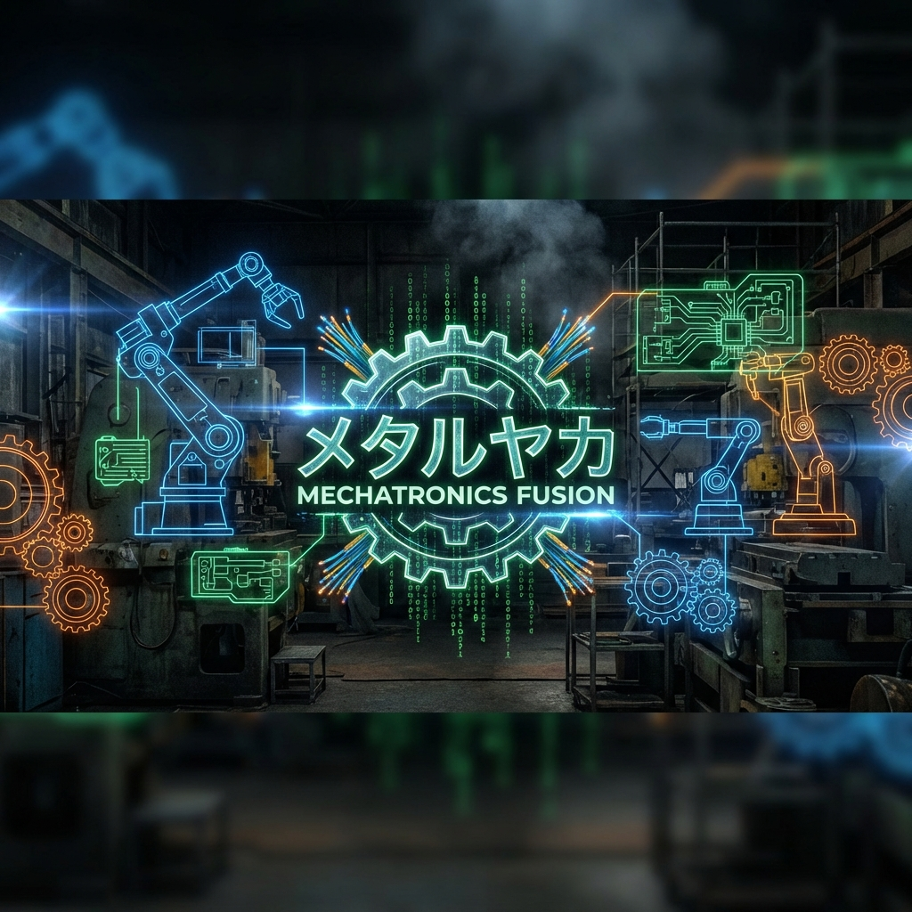
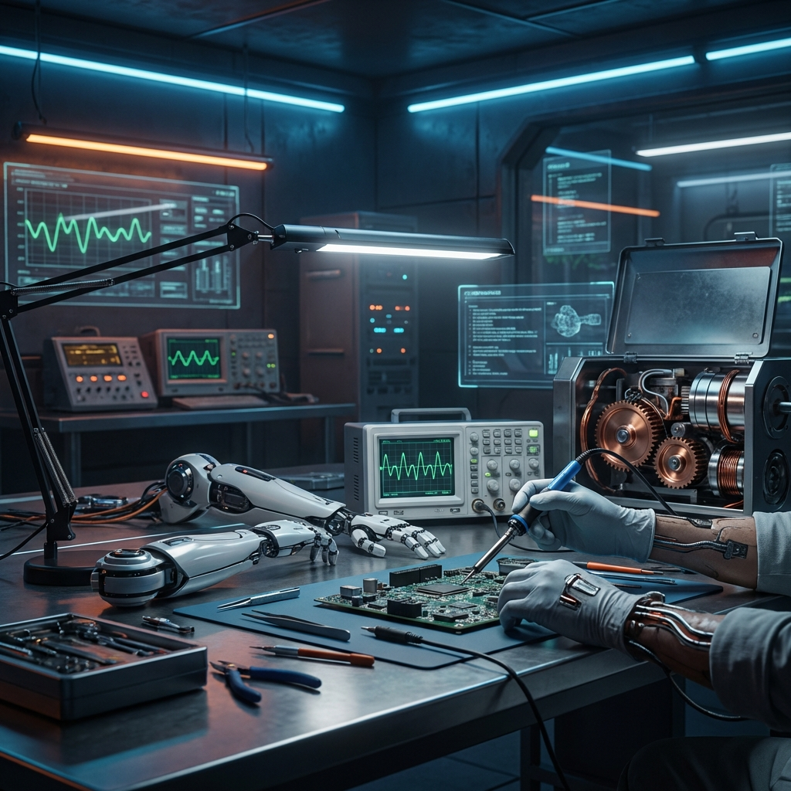
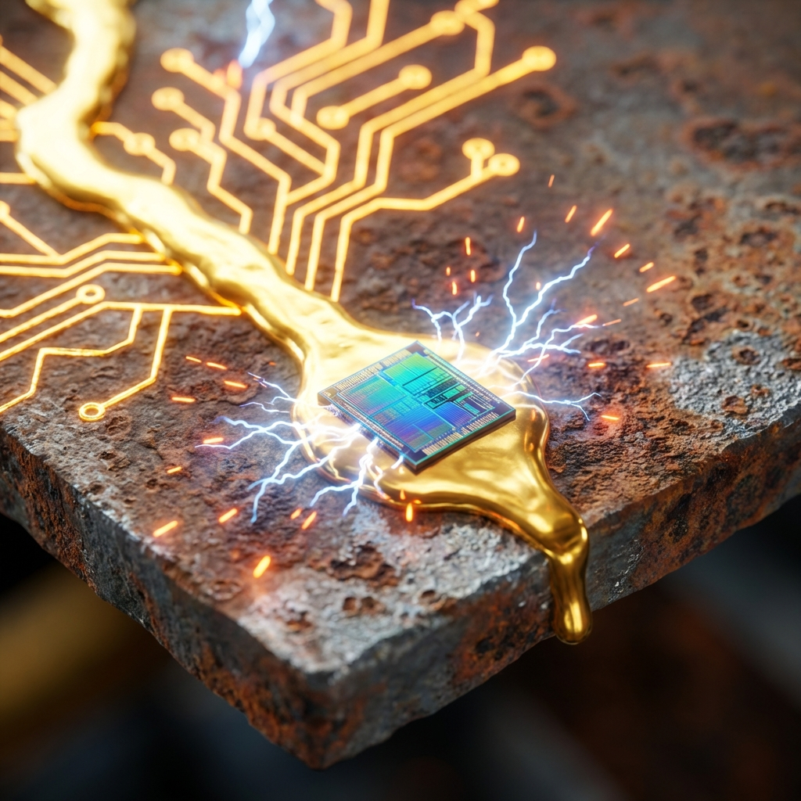
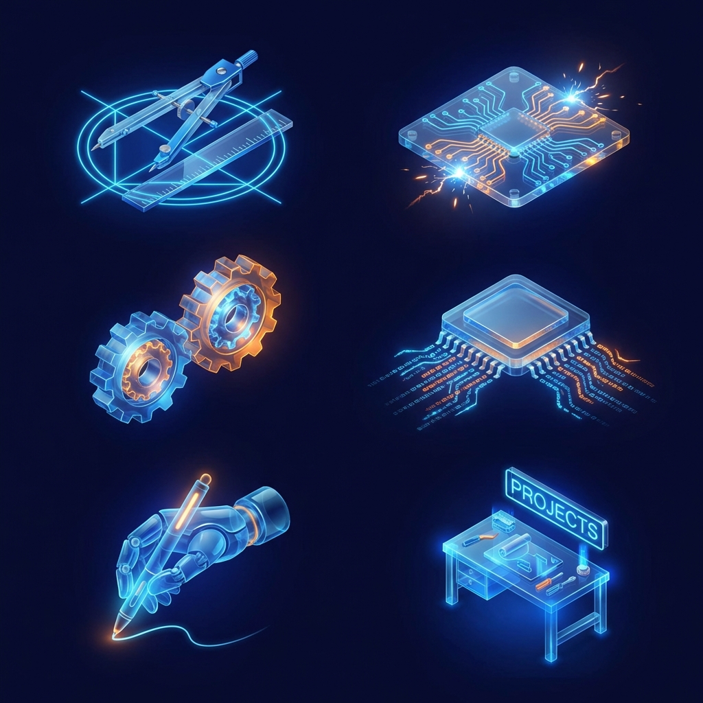



  
  
  

---

  <b>[ 📚 <a href="./01_Engineering_Fundamentals/">Fundamentals</a> ]</b> &nbsp; | &nbsp; 
  <b>[ ⚡ <a href="./02_Electrical_Electronics/">Electronics</a> ]</b> &nbsp; | &nbsp; 
  <b>[ ⚙️ <a href="./03_Mechanics_Materials/">Mechanics</a> ]</b> &nbsp; | &nbsp; 
  <b>[ 💾 <a href="./04_Programming_Embedded/">Embedded</a> ]</b> &nbsp; | &nbsp; 
  <b>[ 🦾 <a href="./05_Control_Robotics/">Robotics</a> ]</b> &nbsp; | &nbsp; 
  <b>[ 🧪 <a href="./06_Projects_Labs/">Laboratory</a> ]</b>

---

# 🤖 Mekatronik Önlisans & Teknikerlik Müfredatı: Siber Tamircilik Rehberi

> **Mekatronik MYO (Meslek Yüksekokulu) Öğrencileri ve Geleceğin "Usta Tamircileri" İçin Nihai Yol Haritası**  
> *Bu eser, elleriyle değer üreten, arızayı kokusundan tanıyan ve Türkiye'nin dört bir yanındaki MYO sınıflarında/atölyelerinde dirsek çürüten "Metal Yaka" adaylarına ithaf edilmiştir.*

## 🏆 Hierarchy of Mastery: Çıraklıktan Siber Mimarlığa Yolculuk

Mekatronik bir hobi değil, bir disiplinler arası savaş sanatıdır. Aşağıdaki harita, bir "Metal Yaka"nın evrimsel basamaklarını gösterir:

```mermaid
graph LR
    subgraph Level1 [🐣 Apprentice - Fundamentals]
        L1A[Digital Multimeter Mastery] --> L1B[Basic Soldering]
        L1B --> L1C[Ohm's Law in Action]
    end

    subgraph Level2 [🔧 Technician - Integration]
        L1C --> L2A[PLC Logic & Wiring]
        L2A --> L2B[Sensor Calibration]
        L2B --> L2C[Motor Driver Tuning]
    end

    subgraph Level3 [🦾 Specialist - Robotics]
        L2C --> L3A[Inverse Kinematics]
        L3A --> L3B[Computer Vision]
        L3B --> L3C[RTOS Threading]
    end

    subgraph Level4 [🌌 Sovereign Architect - Mastery]
        L3C --> L4A[AI System Synthesis]
        L4A --> L4B[Predictive Maintenance]
        L4B --> L4C((THE SOVEREIGN ARCHITECT))
    end

    style L4C fill:#00e676,stroke:#000,stroke-width:4px,color:#000
    style Level1 fill:#f5f5f5,stroke:#333,stroke-dasharray: 5 5
    style Level2 fill:#e3f2fd,stroke:#0d47a1
    style Level3 fill:#fff3e0,stroke:#e65100
    style Level4 fill:#1a237e,stroke:#fff,color:#fff
```

Amacımız, sadece vize ve finalleri geçirmek değil, **Yapay Zeka (AI)** devrimi sonrası temellerinden sarsılan ve yeniden kurulan endüstriyel dünyada ayakta kalacak, vazgeçilmez bir mesleki kimlik inşa etmektir. Türk sanayisinin ihtiyacı olan şey sadece diploma değil, **"sahada iş çözen"** nitelikli insan gücüdür.

Bu depo, akademik dünyanın köklü **teorik derinliği** ile; Türkiye'nin dört bir yanındaki sanayi bölgelerinin, iş makinelerinin gürültüsü ve metalin kokusuyla dolu **pratik endüstriyel uygulamasını** birleştiren eşsiz bir köprüdür. 20. yüzyılın mühendislik yaklaşımı olan "her şeyi sıfırdan hesapla ve tasarla" devri kapanmıştır. Artık "AI'ın saniyeler içinde tasarladığı karmaşık sistemleri fiziksel dünyada birbirine bağla, yaşat, entegre et ve hatasız çalıştır" devri başlamıştır. Bu depo, diferansiyel denklemlerin soyut dünyasından çıkıp, o denklemlerin çalıştırdığı robot kolunun hidrolik sızıntısını tamir etmeye giden engebeli yolun detaylı haritasıdır.

### 🛡️ Manifesto: MYO Kültürü ve "Yeni Nesil Tamircilik"

> *"Bizler sadece sınav kağıdı dolduran öğrenciler değiliz; bizler dijital çağın ameliyat ekibiyiz. Mühendis sistemi tasarlar, AI kodunu yazar, biz ise o sistemi MYO laboratuvarından çıkarıp fabrikanın kalbinde yaşatırız."*

Mekatronik Önlisans eğitimi, bir teorik bilgi yığını değil, bir **hayatta kalma ve çözüm üretme** eğitimidir. Bu depo, klasik beyaz yaka mühendislik yaklaşımlarının "sahada çuvalladığı" noktalarda, bir teknikerin nasıl parladığını anlatır. Amacımız, sadece diploma almak değil, **"Arıza benden sorulur"** diyen sarsılmaz bir özgüven inşa etmektir.

#### 🌌 Dijital İkizlerden Gerçek Yağ Lekelerine
Modern sanayi, "Digital Twin" (Dijital İkiz) kavramıyla simülasyonların gücüne güveniyor. Ancak hiçbir simülasyon, bir hidrolik hortumun patladığı andaki kaosu veya bir sensörün üzerine binen toz tabakasının yarattığı gürültüyü tam olarak tahmin edemez. Bizler, o simülasyonların bittiği ve gerçek dünyanın yıpratıcı kurallarının başladığı yerde devreye gireriz.

**Metal Yaka İnisiyatifi**'nin kalbi MYO'larda ve teknik eğitim merkezlerinde atar. Bizler, iki dünya (Soyut Tasarım ve Somut Arıza) arasındaki en kritik halkayız. AI bir robotu tasarlar; bizler ise o robotun "tesisatını" döşer, "damarlarındaki" tıkanıklığı açar ve sistem sustuğunda onu uyandıran ilk nefes oluruz. İşte bu, **Tekniker 2.0**'ın; yani elinde multimetre, zihninde AI gücü olan siber zanaatkarın geleceğidir.

### 🎯 Vizyon & Misyon: Yeni Tamircilik Kültürü

*   **Vizyon:** Yapay zeka destekli ileri tasarım tekniklerini, yüzyılların getirdiği "Usta-Çırak" ve Anadolu'nun "Ahi" kültürüyle harmanlayan; duran fabrikaları, arıza yapan otonom sistemleri, kilitlenen robotları hayata döndüren bir nesil yetiştirmek.
*   **Misyon:** Karmaşık teorik hesaplamaların yükünü AI asistanlarına devredip, insanın odak noktasını "Arıza Tespiti (Diagnosis)", "Sistem Entegrasyonu" ve "Sistemi Ayakta Tutma" sanatına kaydırarak; pratik, tecrübeye dayalı "kirli el" bilgisini herkes için erişilebilir kılmak.

---

### 🚀 Kariyer Yolu: Önlisans'tan Sektör Liderliğine

Mekatronik Önlisans mezunu bir öğrenci için kariyer yolu sadece "bir fabrikada bakımcı olmak" değildir. Modern dünyada önünüzde açılan kapılar şunlardır:

1.  **Saha Entegrasyon Uzmanı:** AI tarafından tasarlanan sistemlerin fiziksel montajını ve devreye alımını yönetmek.
2.  **Kestirimci Bakım Analisti:** Sensör verilerini okuyarak (Türev ve İntegral bilgisiyle) makinenin ne zaman arıza yapacağını önceden tahmin etmek.
3.  **Robotik Hücre Operatörü:** Endüstriyel robot kollarının programlanması, kalibrasyonu ve zorlu saha şartlarında onarımı.
4.  **Gömülü Sistem Tamircisi:** Arıza yapan PLC, MCU veya sürücü kartlarının komponent seviyesinde tamiri ve optimizasyonu.

---

## 🏗️ Depo Yapısı ve "Tamircinin Bakış Açısı"

Bu depo, bir teknikerin zihnindeki "Arıza Çözme Algoritması"na göre yapılandırılmıştır. Her modül, sahada karşılaşılan bir sorunun çözüm basamağını temsil eder.

| Dizin | Odak Noktası | Tekniker Ne Yapar? |
|-----------|-------------|----------------------------------------------------|
| [`01_Engineering_Fundamentals`](./01_Engineering_Fundamentals/) | Teşhis | Makinenin dilini (fiziğini) anlar, anomalileri tespit eder. |
| [`02_Electrical_Electronics`](./02_Electrical_Electronics/) | Müdahale | Devreye cerrah titizliğiyle yaklaşır, arızalı parçayı bulur. |
| [`03_Mechanics_Materials`](./03_Mechanics_Materials/) | Restorasyon | Aşınan, kırılan, yorulan metalin sesini duyar ve onarır. |
| [`04_Programming_Embedded`](./04_Programming_Embedded/) | Canlandırma | Kodu metale enjekte eder, donanımı hayata döndürür. |
| [`05_Control_Robotics`](./05_Control_Robotics/) | Senkronizasyon | Karmaşık hareketleri yönetir, robotları hizaya sokar. |
| [`06_Projects_Labs`](./06_Projects_Labs/) | Deneyim | Hata yapar, patlatır, öğrenir ve tecrübeyi günlüğe yazar. |

---

## 🎨 Metal Yaka Modül Galeresi

Her bir modül, kendi uzmanlık alanında derinleşen birer disiplindir.

---

## 🔥 Metal Yaka Saha İpuçları (Field Hacks)

Teori bazen sahada çöker. İşte "Usta" tecrübesiyle sabitlenmiş bazı kurallar:

> [!TIP]
> **Elektronik Kanunu:** Eğer devre balık gibi kokuyorsa (sıvı elektrolitik sızıntısı), bir kondansatör ölmek üzeredir. Eğer ozon kokuyorsa (ark yapma), hemen fişi çekin; yangın çıkmak üzeredir.

> [!IMPORTANT]
> **Mekanik Altın Kural:** Hareket etmesi gereken şey etmiyorsa; **WD-40**. Hareket etmemesi gereken şey ediyorsa; **Loctite (Vida Sabitleyici)**. İkisi de yetmiyorsa, yanlış kuvvet uyguluyorsunuzdur.

> [!WARNING]
> **Hata Ayıklama (Debugging):** Sistemin yarısı çalışıyor, yarısı saçmalıyorsa; sorunu kodda değil, **Güç Kaynağında (PSU)** veya **Topraklamada (GND)** arayın. Elektrik dalgalıysa beyin (CPU) sapıtır.

---

## 🛠️ Teknoloji Yığını & Tamir Çantası

Modern bir Mekatronik Teknikerinin, yani Metal Yaka mühendisinin alet çantası; hem dijital (yazılım/AI) hem de fiziksel (donanım/tamir) araçlarla doludur ve bu iki dünya arasında akışkan bir geçiş gerektirir.

### 💻 Yazılım & Gömülü Sistemler (Dijital Teşhis Cihazları)
*   **Diller:** C ve C++ (Donanımla, bitlerle ve baytlarla konuşmak için), Python (AI modelleriyle ve veri analiziyle konuşmak için), MATLAB (Sistemin hastalığını simüle etmek için).
*   **Gömülü Platformlar:** STM32 (Endüstriyel standart, ARM mimarisi) ve ESP32 (IoT). Bunlar sadece silikon çip değildir; makinenin beynidir. Bir beyin cerrahı titizliğiyle, register (yazmaç) seviyesinde müdahale ederiz.
*   **RTOS (Gerçek Zamanlı İşletim Sistemi):** Makinenin kalp ritmini ve zamanlamasını yönetiriz. Görevleri (Tasks) önceliklendiririz.

### ⚙️ Mekanik & Tasarım (Fiziksel Müdahale Araçları)
*   **CAD (Bilgisayar Destekli Tasarım):** SolidWorks ve Fusion 360. Bozulan, kırılan bir parçayı yeniden çizmek ve 3D yazıcıda basmak için. "Yedek parça bekleme, kendin üret" felsefesi.
*   **Tersine Mühendislik:** Bir makinenin nasıl çalıştığını (veya neden bozulduğunu) anlamak için onu söküp sanal ortamda yeniden oluşturmak.

### 🔌 Elektronik & Kontrol (Sinir Ağı Onarımı)
*   **EDA (Elektronik Tasarım Otomasyonu):** Altium Designer ve KiCAD. Yanmış bir kontrol kartının yerine daha iyisini, daha dayanıklısını tasarlayıp üretmek için.
*   **PLC & Otomasyon:** Siemens TIA Portal. Fabrikanın işletim sistemi. Bir fabrikayı durduran o sinsi "bug"ı bulup, milyon dolarlık üretimi yeniden başlatmak.
*   **ROS (Robot İşletim Sistemi):** Modern robotların dili. Otonom bir aracın sensör verilerini nasıl işlediğini anlamak ve sensör körleştiğinde (Lidar arızası vb.) müdahale etmek.

---

## 🚀 Kariyer Yol Haritası: Çıraklıktan Arıza Uzmanlığına

Mekatronik, disiplinler arası uçsuz bucaksız bir okyanustur. Bu okyanusta "usta" olmak, her şeyi teorik olarak bilmek değil, karşılaştığın her sistemi "tamir edebilmek" ve "yürütebilmek" demektir.

### Faz 1: Çırak - Aleti Tanıma ve Saygı Duyma (Yıl 1-2)
Bu aşamada amacımız, elimizdeki aletlerin (hem yazılım hem donanım) dilini çözmek ve limitlerini öğrenmektir.
*   [ ] **Multimetre ile Dost Olun:** Bir devredeki kısa devreyi, ekrandaki kodunuza bakarak bulamazsınız. Ölçmeyi, prob tutmayı öğrenin.
*   [ ] **Kodu AI'a Yazdırın, Siz Okuyun:** C++ sözdizimini ezberlemekle aylar kaybetmeyin. AI'ın yazdığı kodun donanımda ne yaptığını (Hangi transistörü açtığını, hangi veriyi gönderdiğini) satır satır anlayın.
*   [ ] **İlk Patlama:** Bir kondansatörü ters bağlayıp veya bir LED'i dirençsiz bağlayıp patlatın. Çıkan o koku, bir mühendisin vaftiz törenidir. O korkuyu yaşayın.

### Faz 2: Kalfa - Sorun Çözme ve Entegrasyon (Yıl 3)
Artık basit devreler kurmuyorsunuz, karmaşık sistemlerin neden çalışmadığını, neden uyumsuzluk çıkardığını buluyorsunuz.
*   [ ] **Hata Ayıklama (Debugging) Sanatı:** Yazılımdaki "breakpoint" neyse, elektronikteki "osiloskop" odur. Gürültüyü, paraziti, dalgalanmayı gözünüzde görün.
*   [ ] **Mekanik Entegrasyon:** Motoru boşta döndürmek kolaydır; motoru bir yüke bağlayıp, mili kırmadan, dişliyi sıyırmadan o yükü kaldırmak gerçek mühendisliktir.
*   [ ] **Datasheet Okuryazarlığı:** Bir çipin veya sensörün 100 sayfalık kullanım kılavuzunu (datasheet) okumak, bir doktorun hastanın röntgenini okuması gibidir. Her şey orada yazar.

### Faz 3: Usta / Baş Teknisyen - Sistem Mimarı (Yıl 4+)
Parçaları değil, sistemin bütününü, mimarisini ve ruhunu yönetirsiniz.
*   [ ] **Sistem Doktorluğu:** Robot kolu hafifçe titriyor mu? Sorun PID katsayısında mı (yazılım), redüktör dişlisindeki boşlukta mı (mekanik), yoksa enkoder kablosundaki parazitte mi (elektronik)? Bunu tek bakışta, sesten ve titreşimden anlamak.
*   [ ] **AI Entegrasyonu:** Bir kamerayı robota bağlayıp, AI'ın gördüğü (Computer Vision) şeye göre robotun fiziksel dünyada hareket etmesini sağlamak. Dijital beyni, metal gövdeye hükmeder hale getirmek.
*   [ ] **Kendi Aletini Yap:** İhtiyaç duyduğun cihaz, sensör veya yazılım piyasada yoksa; oturup tasarla, kodla, üret ve kullan.

---

---

## 📜 Metal Yaka Manifestosu: 10 Emir

Sahadaki her "Siber Tamirci"nin uyması gereken, kanla ve yanıklarla yazılmış kurallar:

1.  **Asla Varsayma, Ölç:** "Elektrik yoktur" deme, kontrol kalemiyle bak. "Voltaj 5V'tur" deme, multimetreyle ölç. Varsayım, kazaların anasıdır.
2.  **Topraklama Hayattır:** İyi bir topraklama yoksa, o sistem asla stabil çalışmaz. Hayalet arızalarla ömrünü çürütürsün.
3.  **Önce Kapat, Sonra Dokun (LOTO):** Enerji altındaki panele elini sokma. Kilitle, Etiketle, Emniyete Al. Kahraman olma, hayatta kal.
4.  **Datasheet Kutsal Kitabındır:** Bir parçayı kullanmadan önce onun sınırlarını (Max Ratings) oku. Okumazsan, dumanla haberleşirsin.
5.  **Duman Çıktıysa O İş Bitmiştir:** Elektronikte "geri al" tuşu yoktur. Yanan parça, arkasındaki hatayı (kısa devre, aşırı yük) işaret eder. Sadece parçayı değiştirme, katili bul.
6.  **Yedeğin Yedeği Vardır:** Sahaya tek kabloyla, tek sigortayla gidilmez. Murphy Kanunları her zaman devrededir.
7.  **Temiz Kod Değil, Çalışan Kod:** En güzel kod, durmadan 10 yıl çalışan koddur. Karmaşık "Design Pattern"lar değil, hatayı tolere eden (Fault Tolerant) basit yapılar kur.
8.  **Alet İşler, El Övünür:** Havya ucunu temiz tut, multimetrenin pilini kontrol et. Aletine bakmayan, kendine saygı duymaz.
9.  **Bildiğini Saklama, Paylaş (Ahi Kültürü):** Bilgi paylaştıkça çoğalır. Çırağına öğret ki, sen yokken işler yürüsün.
10. **Asla Pes Etme:** Her arızanın bir sebebi ve bir çözümü vardır. Makine insan yapımıdır, insan onu mutlaka çözer.

---

## 🤝 Katkıda Bulunma: Atölyeye Hoş Geldiniz

Açık kaynak felsefesine ve Anadolu'nun İmece kültürüne yürekten inanıyoruz. İster bir meslek lisesi öğrencisi olun, ister bir MYO öğrencisi, isterse sahada yıllanmış bir usta. Bilgi ve tecrübeniz bu kütüphane için paha biçilemezdir.

Lütfen kod standartlarımız, katkı süreci ve topluluk kurallarımız için [`CONTRIBUTING.md`](./CONTRIBUTING.md) dosyasını dikkatlice okuyun. Bilgi, paylaştıkça çoğalan ve değerlenen tek hazinedir.

## 📜 Lisans

Bu proje, bilginin özgürce dolaşımını ve herkesin erişimini desteklemek amacıyla **MIT Lisansı** altında lisanslanmıştır. Detaylar ve yasal haklar için [`LICENSE`](./LICENSE) dosyasına göz atabilirsiniz.

---

## 👨‍💻 Mimar ve Baş Teknisyen Hakkında

<table align="center">
  <tr>
    <td align="center" width="150">
       
      <b>Bahattin Yunus Çetin</b>
    </td>
    <td>
      <b>IT Architect (Bilişim Mimarı) & Metal Yaka Vizyoneri</b> 
      Konum: <b>Şereflikoçhisar / Ankara</b>  
      <i>"Köklerim Şereflikoçhisar'ın bozkırında, vizyonum ise dijital geleceğin zirvesindedir. Ben, AI'ın tasarladığı dijital dünyayı fiziksel dünyada inşa eden, kablolarını çeken, otonom makinelerin nabzını tutan ve onları yaşatan bir Teknoloji Mimarıyım."</i>  
      <b>"Virtual architectures for the sovereign architect."</b> 
      <i>Dijital sistemler birer kafes değil, egemen mimarın elindeki iskeletlerdir. Biz, fiziksel dünyaya hükmetmek için sanal dünyayı tasarlarız. Egemen mimar, yapay zekayı biyolojik kısıtların ötesine uzanan bir bilişsel protez olarak kullanır; her kod satırının kusursuz bir mekanik harekete veya sarsılmaz bir sisteme dönüşmesini sağlar.</i>  
      
      
    </td>
  </tr>
</table>

---

  © 2026 Türkiye Mekatronik ve Otomasyon İnisiyatifi. "Metal Yaka" devrimi burada başlıyor. Tüm hakları saklıdır.

